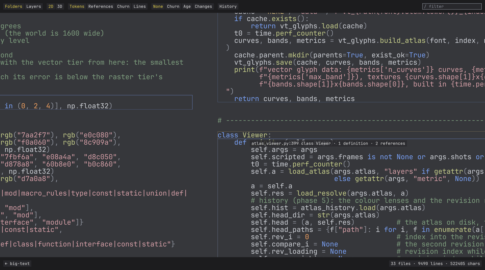
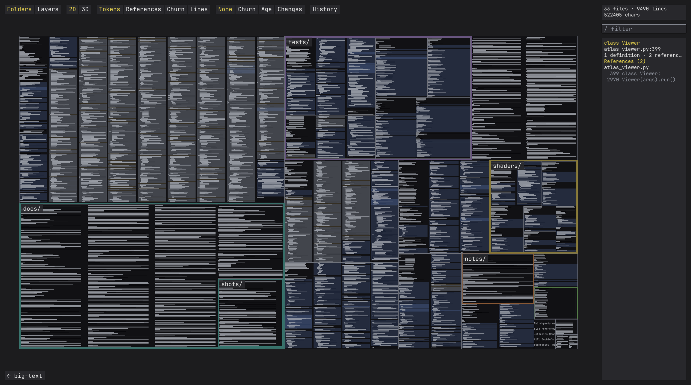
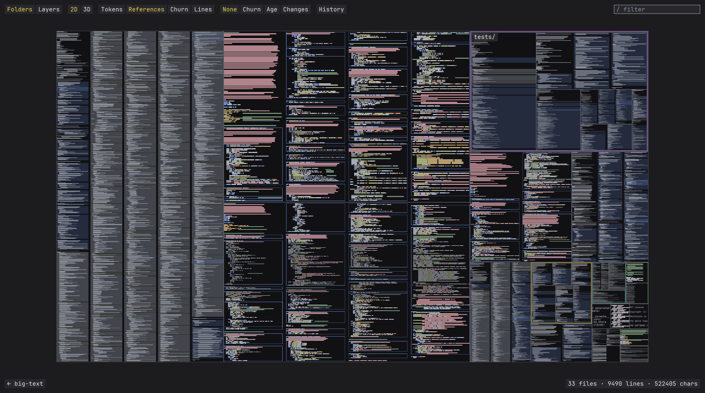
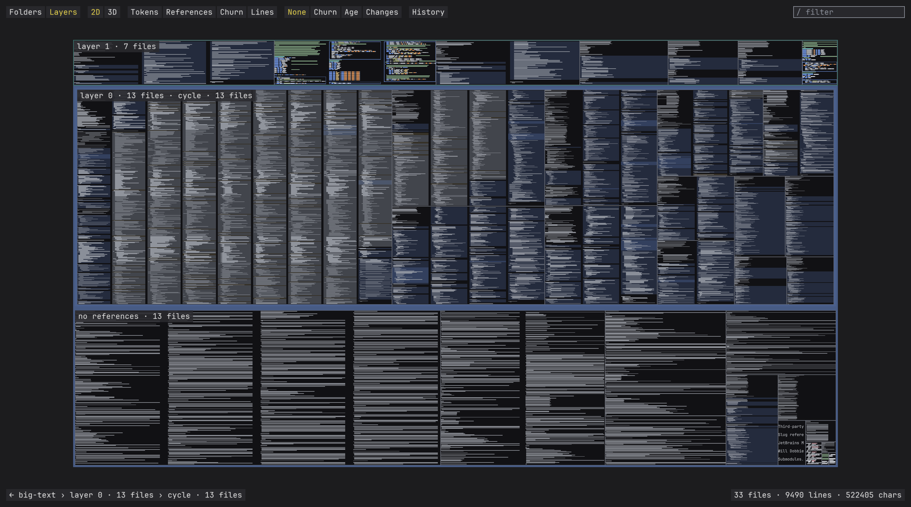
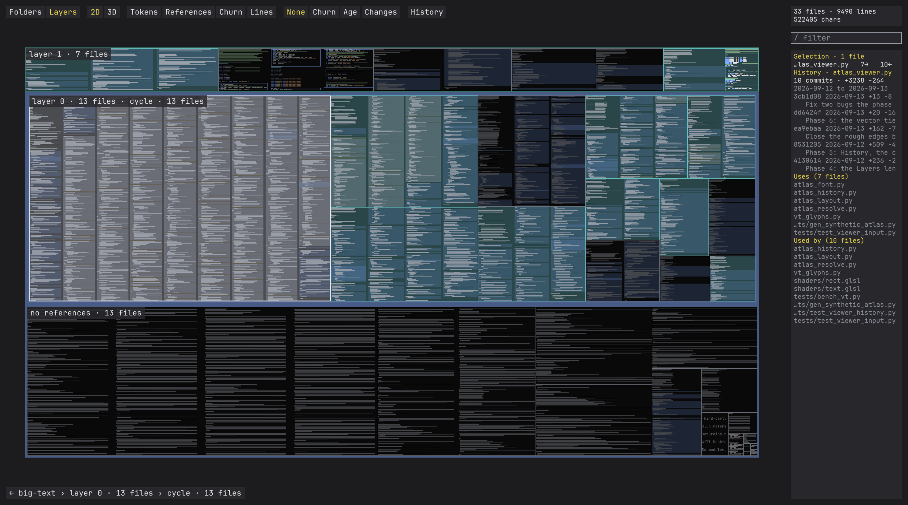
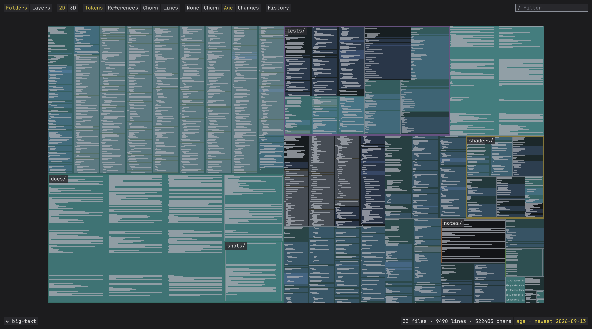
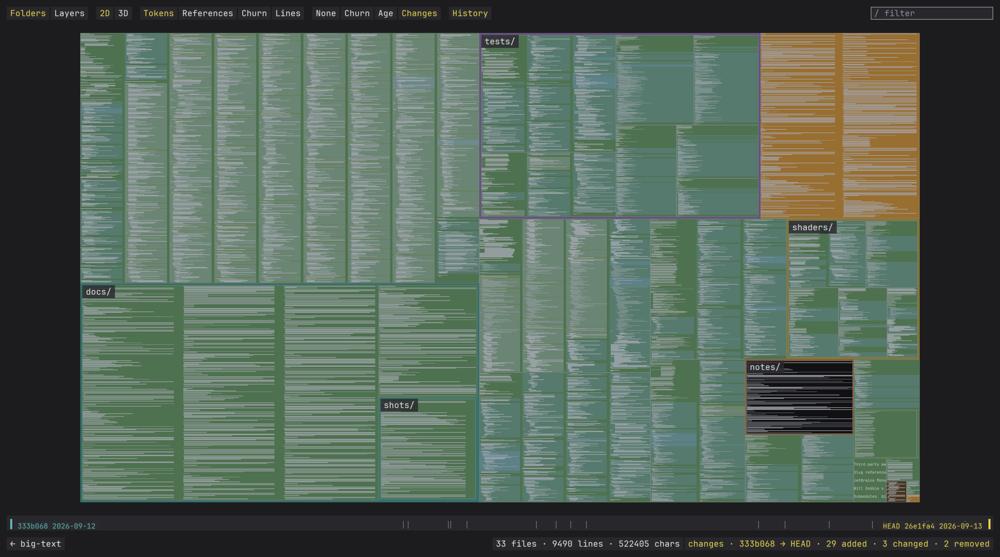
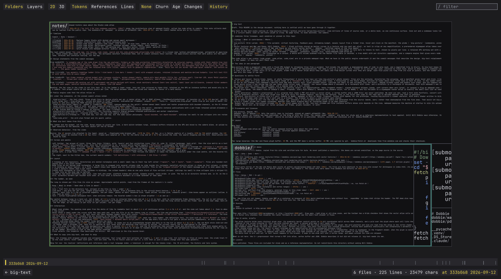
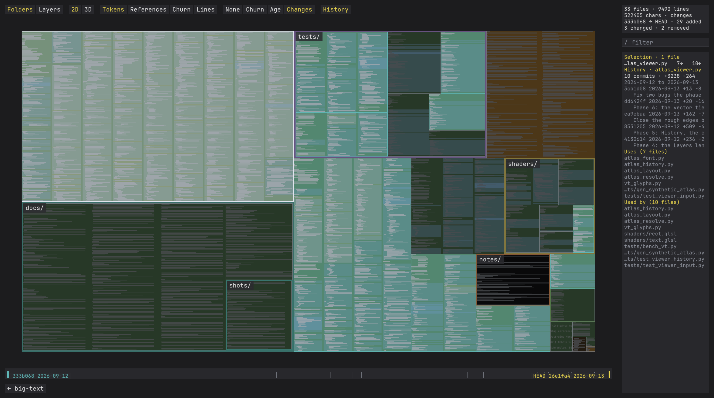

# big-text

big-text is the text-scale sibling of [big-picture](https://github.com/erik-larsen/big-picture): view millions of lines of source code, or a whole book, as one continuous surface. Zoom out and a codebase looks like a circuit board; zoom in and every glyph is crisp. No page turns, no mode switches, one camera.


*big-text viewing itself: 33 files and about 9,500 lines tilted into 3D with the churn lens, the most edited files ember, every roof carrying its code at the rung its size allows, and the rail along the bottom the repository's commits.*

It shows three kinds of content, in this order of priority: text, images, 2D vector work. Each has an open-source lineage, and the ladder that ties them together has a fourth:

| Content | Lineage | Licence | What it contributes | Pinned as |
|---|---|---|---|---|
| Text | [Vector textures](https://wdobbie.com/post/gpu-text-rendering-with-vector-textures/) and [War and Peace](https://wdobbie.com/post/war-and-peace-and-webgl/) (Will Dobbie, 2016) | none published; reimplemented from the posts, no code or data used | The two-tier glyph design: outlines as quadratic bezier curves in a texture, ray-cast per pixel, crisp at any magnification; a mipmapped raster atlas below two texels per pixel; a whole book laid out once as one static vertex buffer | nothing to pin; the two posts are the reference |
| Text | [Slug](https://github.com/EricLengyel/Slug) (Eric Lengyel, 2017; [paper](https://jcgt.org/published/0006/02/02/)) | MIT or Apache-2.0; the patent dedicated to the public domain on 2026-03-17 | The robust vector shader: curves listed per band instead of per grid cell, roots chosen from the signs of the control points so no crossing is counted twice or missed, a box filter along two axis rays | `slug/` at be3c13e; its pixel shader translated into `shaders/vt_glyph.glsl` with the notice kept |
| Images | [big-picture](https://github.com/erik-larsen/big-picture) (Erik Larsen, 2026) | MIT | The camera and the budget: tile pyramid, virtual texturing, feedback pass, streaming under a fixed GPU footprint, mosaic layout from a folder tree | `big-picture/` |
| 2D vectors | [HEPR](https://github.com/soadzoor/Highly-Efficient-PDF-Renderer) (soadzoor, 2026) | MIT | Analytic stroke and fill shaders for PDF paths with stroke level of detail, a PDF parser, a greek tier for sub-pixel glyphs, search and selection over pre-laid-out text, WebGL2 and WebGPU backends | `hepr/` at c81c326 (0.1.29) |
| The ladder | [makepad](https://github.com/makepad/makepad) Studio code atlas (Rik Arends, 2026) | MIT (the repository's LICENSE, Makepad B.V.); the draw and platform crates read here declare MIT OR Apache-2.0 | Semantic level of detail: one ladder from file tile to kind bands to line bars to tokens to text, chosen by pixels per line; a retained GPU working set with a device-derived budget | `makepad/` at a2fdeb325, plus `notes/makepad-code-atlas.md` |

Every lineage with a repository is pinned as a submodule at the commit studied, so what this README says about it can be checked against the code; the pins are references and corpora, not dependencies, and nothing is copied out of them except Slug's pixel shader. Dobbie never published a repository, so his posts are the reference. The code atlas's own crates live in a private makepad repository; big-text reimplements the ladder from the public engine, the commit messages and the video, and reimplements Dobbie's tiers from his posts. HEPR credits Dobbie and keeps his raster tier, but its glyph shader loops over every curve of a glyph, which is why Slug and not HEPR is the text lineage.

[dagcmp](https://github.com/erik-larsen/dagcmp) (Erik Larsen, 2026, MIT, `dagcmp/`) is a corpus rather than a lineage: it scans a whole NTFS volume from the Master File Table in seconds and gives every node of the tree an aggregate and a compare status, which makes it the adapter for a filesystem as a corpus.

## The idea in one paragraph

big-picture draws a gigapixel image with a fixed GPU budget by streaming tiles from a pyramid. Text breaks the pyramid: a downsampled page of code is grey mush, and a magnified tile is blurry. So big-text keeps the streaming and the camera but replaces the pyramid with a ladder of representations. Far away a file is a coloured tile. Closer it is one bar per line, coloured by token kind, which is what makes a codebase look like a die shot. Closer still it is real glyphs, drawn from a raster atlas while they are small and from bezier curves once they are large. Each file picks its rung from its size in pixels, and the viewer streams only the rungs it can see.

## Vector text: Dobbie, Slug, and what big-text takes from each

The two glyph lineages are one technique with a ten-year gap.

| Date | Event |
|---|---|
| 2016-01-02 | Dobbie publishes the technique: quadratic outlines in a texture, a grid of curve lists per glyph, ray casting per pixel, an exact filter along four rotated rays, WebGL 1 on 2016 hardware |
| 2016-01-21 | War and Peace: the raster mip tier for minified text, 2.7 million glyphs as one static buffer |
| Fall 2016 | Lengyel develops Slug |
| 2017-03-27 | Slug provisional patent application; the grant, US 10,373,352 (2019-08-06), cites Dobbie's post as prior art |
| mid 2017 | The JCGT paper cites Dobbie as the closest published method and benchmarks against him, 5.2 ms against 1.3 ms for the same text after correcting for four rays versus two |
| 2026-03-17 | Lengyel dedicates the patent to the public domain and publishes the library's vertex and pixel shaders under MIT |

The patent never covered Dobbie's method. Its one independent claim is the root-selection rule: classify each control point by its sign relative to the ray, then decide from that classification which roots count. Dobbie selects roots by testing whether t lies in (0, 1), which is exactly the step the paper shows to be numerically fragile near shared endpoints and tangents, the cause of his sparkles. So Dobbie's shader was always free to reimplement, and the dedication unlocked only the fix. Everything else in Slug, bands included, was unclaimed or already public in Dobbie's grid.

What each is better at:

- **Slug's vector shader is better everywhere the vector shader is used.** It never double-counts a crossing, its bands hold any number of curves where Dobbie's cells hold eight, its two axis rays cost half of his four, and its bands are widened by half the largest expected pixel, so text stays correct at small sizes where Dobbie's fragment reads one cell and misses its neighbours' curves. His raster tier was the workaround for that.
- **Dobbie's two tiers are the only published answer to sub-legible text.** Slug's cost per pixel is the curve count of the band and its bands assume a smallest font size; a page thumbnail at a fraction of a pixel per glyph is outside it. A mipmapped raster atlas handles that regime correctly and almost for free, because trilinear filtering is the exact prefilter for a shrinking image. HEPR kept the tier for the same reason.
- **Dobbie's static document is a system design, not a shader.** Lay the corpus out once, keep it resident, draw a page as a vertex range, skip pages off screen. It is big-picture's streaming with a single tile, and it is what big-text does today.

So big-text keeps Dobbie's architecture and puts Slug inside its vector tier: bands, the sign-classification rule, the two-ray box filter. The handoff to raster sits where the measurement under Implementation puts it, 12 pixels per line, rather than at Dobbie's fixed two texels per pixel. Below the raster tier the ladder continues with line bars and tiles, the regime neither of them addressed, and the handoff between raster glyphs and line bars is the one open design question in this area.

## One framework, many corpora

The presentation layer is corpus-blind. Every corpus big-text intends to show bottoms out in one of three leaf payloads, and all of the expensive rendering lives in those:

| Leaf payload | Corpora | Renderers |
|---|---|---|
| Text | files of a repo, pages of a book, text of a PDF | the Slug vector tier, the Dobbie raster tier, line bars |
| Images | photos and other large images, images in a PDF | big-picture's tile pyramid and virtual texturing |
| 2D vectors | drawings in a PDF, layouts of a DXF | stroke and fill shaders with stroke level of detail from HEPR; [dxf-visual-spec](https://github.com/erik-larsen/dxf-visual-spec) supplies the DXF semantics |

A page of War and Peace and a file of Rust are the same thing to the text renderers; a DXF and a PDF floorplan are the same thing to the path renderers. Adding a corpus costs no new shader. What differs per corpus is three functions, not a rendering algorithm: the hierarchy (folder tree, chapter and page, year and month, layer and block), the layout (treemap for code, reading order for a book, mosaic for photos, sheets for DXF), and the aggregate colour of a node too small to show its contents (token-kind mix, average colour, layer colour). A corpus adapter supplies those three; the ladder, camera, budget, hit testing and fly-overs are shared. Collections of books, repositories or drawings are hierarchies with documents as internal nodes and need nothing new. Everything is flat: one 2D plane and one camera, the 3D projection being a way of looking at that plane rather than a third kind of content. No adapter interface gets written until three adapters exist: code is built, a book is nearly the same adapter, photos and DXF are the real second and third.

## Install

1. Clone. The submodules are references and corpora, not dependencies: nothing is needed to run big-text on its own source, and `makepad` is the large corpus.

```bash
git clone https://github.com/erik-larsen/big-text.git
cd big-text
```

2. Python 3.12 with the packages in `requirements.txt`, in a virtual environment. numpy, Pillow, PyOpenGL, glfw and fontTools run everything but the resolver; tree-sitter and its Rust, Python and C grammars serve `atlas_resolve.py` only.

```bash
python3 -m venv .venv
source .venv/bin/activate
pip install -r requirements.txt
```

3. A GPU and driver with OpenGL 3.3 core. Developed and measured on macOS with an M4; Linux with Mesa or vendor drivers should work and is untested; Windows is untested. The default face is bundled under `fonts/` with its OFL licence, and git is used only by the history stage.

4. Check the install: the first test needs no window, the second opens a hidden one and compares the vector tier against Pillow.

```bash
./tests/test_history.py
./tests/test_vt_glyphs.py
```

There is no build step. The scripts run in place, and the build is generating an atlas from a corpus, the first four commands below.

## Run

Five steps: index a source tree, resolve its names, read its git history, lay it out, view it. Everything generated lands under `data/`, which git ignores, and every step prints what it did and how long it took. The resolve and history steps are optional: without resolve the filter is a plain word search and there is no Inspector, without history there are no colour lenses and no revision rail. The default example is big-text itself, 33 files and about 9,500 lines with this README among them, prepared in under a second:

```bash
./atlas_index.py . --out data/big-text_atlas
./atlas_resolve.py data/big-text_atlas
./atlas_history.py data/big-text_atlas
./atlas_layout.py data/big-text_atlas
./atlas_viewer.py data/big-text_atlas
```

For scale, fetch makepad (300 MB) and index its drawing and platform crates together, 493 files and 280,607 lines, or the whole tree, 7,145 files and 3.67 million lines (4 seconds to index, 0.4 to lay out, 380 MB on the GPU):

```bash
git submodule update --init makepad
./atlas_index.py makepad/draw makepad/platform --out data/makepad-draw_atlas
./atlas_resolve.py data/makepad-draw_atlas
./atlas_history.py data/makepad-draw_atlas
./atlas_layout.py data/makepad-draw_atlas
./atlas_viewer.py data/makepad-draw_atlas
```

Glyphs from 12 device pixels per line come from the vector tier by default, crisp at any magnification; the first run builds its curve and band textures in a tenth of a second and caches them under `data/`, and `--no-vector-text` keeps the raster atlas at every size. `--goto path:line`, `--zoom PX_PER_LINE`, `--filter WORD`, `--step K`, `--color churn|age|changes`, `--rev HASH`, `--compare HASH`, `--history`, `--frames N --screenshot out.png`, `--shots DIR` and `--stats` script the viewer for screenshots and timing; `docs/shots/README.md` lists the commands that made every image here.

## Controls

| Input | Action |
|---|---|
| Wheel | Zoom about the cursor, with a short glide |
| Left or right drag | Pan; the map follows the cursor |
| Hover | Light fill on the file, a label with path, line and enclosing item |
| `/` or click the box | Type a filter: every file with a hit gets a yellow border, the rest dim, the panel lists definitions then references |
| `Enter` `]` `Down` / `[` `Up` | Fly to the next / previous result |
| Click a result | Fly to it |
| Click a symbol at text zoom | Select it in the Inspector: kind, definition, scope, every reference |
| `I` / `Tab` | Open or close the Inspector / switch between Inspector and Results |
| Toolbar or `M` | Switch the area metric: Tokens, References, Churn, Lines (a hard cut to another layout) |
| `3D` button or `3` | The tilted projection: files and directories extruded by the current metric |
| `Layers` button | The Layers lens: files in rows by dependency rank, cycles grouped, hue kept from the tree |
| Click a file | Select it: its neighbours in the file graph light up in teal, the rest dim, the Inspector lists uses and used-by |
| `Shift` + click / `Shift` + drag | Toggle a file in the selection / select every file in a rectangle |
| `Alt` + drag | Tilt (vertical) and turn (horizontal) the 3D camera; from 2D it switches to 3D |
| Toolbar or `C` | Cycle the colour lens: None, Churn (lines added and removed, ember), Age (time since the last commit, teal), Changes (added green, changed amber, against the compare revision) |
| `H` or the `History` button | Show the revision rail along the bottom, one tick per commit, oldest left. Click loads the corpus at that commit (re-indexed in a thread, cached on disk, a hard cut when ready); `Shift` + click sets the compare revision; `Left` / `Right` step by one commit, with `Shift` the compare revision |
| `R` | Refit the map |
| `Escape` | Clear the filter, then the selection |

## What it looks like

Every image is big-text viewing its own source; `docs/shots/README.md` has the command behind each, and `docs/shots/makepad-draw/` holds the same set on makepad's drawing and platform crates, 493 files and 280,607 lines, where the scale is the point.

The map fitted to the window. Every file is a rectangle wrapped into columns, the directories are bands in their own hue, and at this size the files sit on the line-bars rung, one grey bar per line from indent to length.


The four rungs, from the fitted map through 2, 4.5 and 16 device pixels per line: bars, token blocks with item outlines, then text.


The filter `Viewer`: the three files that define or use it outlined in yellow, the rest dimmed, the panel listing the one definition and four references; then the view after stepping to the first result, the hit filled yellow at text zoom.


The resolver's view: hovering `Viewer` at its definition shows its definition and reference counts, and the Inspector on the class lists its references grouped by file.




The map laid out by references instead of tokens: the files everything imports grow, the notes and documents shrink.



The 3D projection over the references layout: the most referenced files as the tallest buildings, directories as terraces, the ladder still drawn on every roof so the near rows are text and the far rows are bars.


A long line wrapped inside its column at text zoom, the continuation rows hanging in by two characters: this README's longest paragraph.


The Layers lens: every file in a row by its dependency rank, the 13 scripts that reference each other grouped as one cycle, the 13 files nothing references in a row of their own; and `atlas_viewer.py` selected, lighting the 7 files it uses and the 10 that use it, with its history in the Inspector.




The two glyph tiers at 120 pixels per line: the 64 pixel raster atlas magnified (left) and the vector tier (right).


The colour lenses over the fitted map: churn (lines added and removed over the whole history, log scale, in ember) and age (rank by last commit, newest in teal). The bars and glyphs are untouched; only the file fill carries the lens.




Changes between the first commit and HEAD, with the revision rail along the bottom: 29 files added in green, 3 changed in amber by the fraction of their lines touched, 2 removed and counted in the status line, the two revisions tagged on the rail.



The corpus loaded at that first commit, 6 files and 225 lines, re-indexed from `git archive` in under a second and cached; its resolver and other layouts follow in the background, and the map keeps the camera.



A file selected with the Changes lens on: the Inspector shows its commits, dates, lines added and removed, and its newest five commits before its Uses and Used-by lists.



## Implementation

The contract the code was built against is [docs/DESIGN.md](docs/DESIGN.md), with the deviations found while building. The short version:

- **Index.** `atlas_index.py` walks the tree (honouring `.gitignore`, skipping binaries and submodules), expands tabs, maps every character to one column, and runs a small regex tokenizer per language family (Rust, C-like, Python, shell, plain) that gives every character one of ten kinds. Items (functions, structs, enums, impls, modules) come from regexes with brace or indentation matching. The output is a handful of numpy arrays: characters, kinds, line offsets, file ranges, item ranges.
- **Layout.** `atlas_layout.py` is a squarified treemap over the directory tree with padding per level, which the viewer draws as the directory band, so the bands widen as you zoom. It writes one layout per metric (tokens, references from the resolver's fan-in, churn, lines) and the toolbar switches between them with a hard cut, the world staying the same size so the camera does not move. Each file is wrapped into as many equal columns as keep a 90th-percentile line width readable; lines longer than a column wrap inside it, continuation rows hanging in by two characters. `tests/check_layout.py` checks the invariants.
- **The ladder.** Per frame the viewer computes device pixels per line for every file and picks a rung: under 1, sampled one-pixel bars; 1 to 3, one grey bar per line from indent to length, with items as filled bands in their kind colour beneath; 3 to 6, one block per character in its kind colour plus item outlines; 6 and up, glyphs. The switches are hard cuts, as in the video. Everything is resident: characters and kinds as 8-bit textures, lines and files as float and integer textures, one instanced quad per line drawn per run of visible files.
- **Glyphs.** `atlas_font.py` rasterises the 95 printable ASCII glyphs of one monospace face into a mipmapped atlas that also draws the UI; the line box is the face's ASCII ink extents rather than its OS/2 box, so a change of face does not change the proportions of the layout. `vt_glyphs.py` builds the vector tier's data in Slug's form: quadratic outlines from fontTools as float32 control points in a curve texture, and per glyph horizontal and vertical bands over its ink box, each listing the curves that cross it sorted for the shader's early exit. `shaders/vt_glyph.glsl` is a GLSL translation of the reference pixel shader: the sign-bit root rule, two axis rays with a box filter, the weighted combination.
- **Resolver.** `atlas_resolve.py` parses every file with tree-sitter and collects entities (functions, methods, structs, fields, enums, variants, traits, type aliases, consts, statics, modules, macros, type parameters, parameters, locals) and every identifier use. Each use is resolved lexically, in order: the enclosing function's locals, the file, the file's `use` imports through the crate found by its Cargo.toml, a unique name in the crate, a unique name in the corpus; what is left is ambiguous, external, missing import, missing macro or not found, and the counts of each are the Inspector's coverage block. No type inference, so a method after a dot with several candidates is "method dispatch", the same category Rik's analyser reports. Rust is covered fully; Python and C get functions, types, parameters and locals. All of makepad resolves in 25 seconds on ten cores: 864k entities and 4.7 million references, 64 percent of them resolved, across 317 crates; Rik's Inspector reports 722k entities and 1.3 million edges for the same tree, so the scale matches even though the rules do not.
- **Filter.** A word that names an entity lists its definitions with their kinds and every reference with its status; any other word is a whole-word regex over the corpus in a thread, chunked so the frame loop keeps running, with mentions inside comments and strings excluded. `Window` in makepad-draw finds 2 definitions and 152 references, 91 of them resolved; Rik's analyser reports 119 and 1472 for all of makepad.
- **Fly-to** is van Wijk and Nuij's smooth zoom-and-pan, which zooms out and back in between distant places.
- **Layers and selection.** The resolver's references give a file graph, A to B when a reference in A resolves into B. The Layers lens runs Tarjan on it, condenses the cycles, ranks each component by its longest path down to a file that references nothing in the corpus, and lays the ranks out as rows, cycles as groups inside their row, files keeping the hue of their real directory. A click selects a file, Shift-click toggles, Shift-drag marquees; the selection's neighbourhood in both directions is lit in teal, everything else dims, and the Inspector lists the selected files with their degrees, then the files they use and the files that use them.
- **3D.** Every world shader takes one model-view-projection matrix, orthographic in 2D and perspective in 3D, so the flat view is unchanged. The camera orbits a focus point at tilt and yaw, at a distance chosen so one world unit at the focus is the same number of pixels as in 2D, which keeps the zoom semantics and the per-file rung: a file's pixels per line is foreshortened by its depth, so one frame has text near and bars far. Directories are terraces, files rise from their terrace by the square root of the current metric, an instanced wall pass draws the sides shaded by which way they face, and the focus height rides on the roof of the file under the centre so a close camera never ends up inside a building.
- **History.** `atlas_history.py` runs one `git log --numstat` over the indexed directories (half a second for the 689 commits touching makepad's draw and platform crates) and writes per-file commit counts, lines added and removed, first and last commit times, and a per-revision table of the files each commit touched, so everything windowed is computed in the viewer without calling git; a rename counts as a removal and an addition. Churn is a fourth area metric, so it also drives the 3D heights. The colour lenses tint the file fill only: churn on a log scale in ember, age in teal, and changes between the loaded revision and a compare revision picked on the rail, added files green and changed files amber by the fraction of their lines touched, removed files counted in the status line and listed in the Inspector since they have no rectangle to light. The rail loads a revision by extracting it with `git archive`, indexing and laying it out into a cache under the atlas, then swapping every GPU texture with the camera kept; its resolver and other layouts follow in the background a second or two later. The Inspector shows each selected file's commits, dates, lines added and removed and newest five commits.
- **The window.** The map's viewport is the window minus a top strip (toolbar and filter box), a bottom strip (crumb trail, status, and the revision rail when shown) and the right column while the results panel is open, so the fitted map is clear of every control. The window is sized to the screen's work area explicitly, which makes the framebuffer the same in every run and the screenshots reproducible.

Measured on an M4 MacBook at a 2940 by 1640 framebuffer, `--frames 300 --stats` over the scripted zoom from fit to text: makepad-draw 1.6 ms mean and 4.4 ms 99th percentile, or 2.1 and 6.3 with the churn lens and the rail; the full makepad tree 4.5 and 23.7 ms, the tail being the fitted view where all 3.67 million lines are visible, and 1.3 ms once zoomed to text. A past revision of makepad-draw loads in 0.8 s from scratch and instantly from the cache.

`tests/bench_vt.py` measures the vector tier against the raster tier (the 64 px mipmapped atlas sampled as the text rung samples it) on the bundled face, against the exact coverage of the same string: Pillow at eight times the size, box-filtered down, since a hinted reference at the target size favours the raster tier, which is itself a Pillow render. Error is the mean absolute coverage difference over the whole image and over ink pixels; time is one full 2940 by 1640 screen of glyph cells, the best of five batches of fifty draws; sparkle is the number of pixels whose coverage jumps by more than a quarter between neighbouring sub-pixel offsets 0.1 px apart, which a one-pixel box filter cannot do on an edge.

| px per line | tier | error, all | error, ink | ms per screen | cells per screen | sparkle mean | sparkle max |
|---|---|---|---|---|---|---|---|
| 12 | vector | 0.0144 | 0.0636 | 0.48 | 58208 | 7.6 | 16 |
| 12 | raster | 0.0353 | 0.0966 | 0.24 | 58208 | 2.6 | 9 |
| 32 | vector | 0.0038 | 0.0227 | 0.14 | 8160 | 9.4 | 19 |
| 32 | raster | 0.0179 | 0.0787 | 0.07 | 8160 | 0.7 | 3 |
| 96 | vector | 0.0014 | 0.0102 | 0.08 | 901 | 14.5 | 24 |
| 96 | raster | 0.0166 | 0.0967 | 0.04 | 901 | 0.4 | 5 |
| 300 | vector | 0.0005 | 0.0039 | 0.05 | 85 | 30.8 | 49 |
| 300 | raster | 0.0212 | 0.1216 | 0.07 | 85 | 1.3 | 13 |

The vector tier's error is below the raster tier's even at 12 px, so the handoff `VT_MIN_PPL` is 12 px per line and the raster atlas serves only the 6 to 12 px band of the text rung. Vector text is on by default: at 12 px it costs 0.48 ms per screen against the raster tier's 0.24, and at every larger size the two are within a few hundredths of a millisecond.

Not built: the palette and legend buttons, and a streaming working set; the whole corpus is resident, which is fine to a few million lines.

## Open questions

The decisions and their reasons are in [docs/DESIGN.md](docs/DESIGN.md), the checklist against the makepad video in [docs/PARITY.md](docs/PARITY.md). Open:

1. **The next corpus.** A book is nearly the code adapter (pages as files, reading order as the layout); photos exercise the image payload and big-picture's pyramid and are the first real test of the adapter split; a dagcmp volume is the largest hierarchy with the least text. Proposal: book, then photos, then DXF.
2. **Fonts beyond ASCII monospace.** Unicode coverage and proportional faces for books, and a serif face chosen from the OFL families with quadratic outlines (Literata, Libertinus Serif) when the book corpus starts.
3. **The browser.** Python with OpenGL 3.3 is the prototype; the browser is the target. The contract for getting there is the files and the shaders, not the Python: every generated `.npz` gets a documented binary layout, and every shader stays within GLSL ES 3.0 (texelFetch and integer samplers in, geometry shaders and bindless out), so a WebGL2 viewer reads the same atlases and links the same shaders. WebGPU later, from the same data.
4. **Budget and eviction.** Per-file instance ranges under a byte budget for text and big-picture's pages for images; whether one budget covers both. Built only once a corpus needs it.
5. **The handoff from raster glyphs to line bars.** Where a pixel starts to cover several glyphs and per-glyph quads overdraw: a hard cut at a pixels-per-line threshold as today, a blend, or whole lines cached as texture rows first. The one place the ladder is not yet designed, and the same problem in all three payloads.

## Licences

big-text is MIT ([LICENSE](LICENSE), Erik Larsen). What it reuses, with the licence and the way it is reused: pin (a submodule at a commit, the upstream licence applying inside it), translate (code ported with the upstream notice kept), or reimplement (only the published description used, no code). [THIRD_PARTY_NOTICES](THIRD_PARTY_NOTICES) carries the notices.

| Part | Author, licence | How it is reused |
|---|---|---|
| big-picture, dagcmp | Erik Larsen, MIT | pin |
| makepad (public engine) | Makepad B.V., MIT by the repository's LICENSE; its crates declare MIT OR Apache-2.0 in their Cargo.toml, and the vendored libraries under `libs/` carry their own | pin at a2fdeb325; the code atlas is reimplemented from the video and the commit messages, its private crates are not used |
| Slug | Eric Lengyel, MIT or Apache-2.0; patent US 10,373,352 dedicated to the public domain 2026-03-17 | pin at be3c13e; the pixel shader translated to GLSL in `shaders/vt_glyph.glsl` with the notice kept. The 2017 JCGT supplemental GLSL is under the journal's terms and is not used |
| HEPR | soadzoor, MIT | pin at c81c326 (0.1.29); its stroke and fill shaders will be translated with their notices when the vector work starts |
| Dobbie's technique, formats and tiers | Will Dobbie, 2016, blog posts, no licence published | reimplement from the posts; no code or data of his is used |
| JetBrains Mono NL | JetBrains, OFL 1.1 | pin: `fonts/JetBrainsMonoNL-Regular.ttf` with `fonts/OFL.txt` and `fonts/AUTHORS.txt`; the atlases the viewer builds from it are embeddings in the OFL's sense |
| War and Peace | Leo Tolstoy, Maude translation, public domain via Project Gutenberg | the book corpus, laid out by big-text itself, when that corpus starts |

The default face is JetBrains Mono NL Regular: OFL, TrueType with quadratic outlines so the vector tier converts nothing, and legible at the small sizes the ladder spends most of its time at. Its OS/2 line box carries 1.32 em of leading, which would shrink every glyph at a given pixels per line, so the line box is defined as the face's ASCII ink extents, 1.05 em. `--font` takes any face on the machine; nothing generated from a font is committed.

## Layout

```
big-text/
  README.md                    this file
  requirements.txt             the Python packages (pip install -r)
  LICENSE, THIRD_PARTY_NOTICES MIT for big-text; what is reused from whom, and how
  docs/DESIGN.md               the design contract and the as-built deviations
  docs/PARITY.md               the checklist against the makepad video and what is left
  docs/shots/                  screenshots and the commands that made them
  notes/makepad-code-atlas.md  what the public makepad history and the video say about the code atlas
  atlas_index.py               source tree -> data/<name>_atlas/index.npz + index.json
  atlas_resolve.py             tree-sitter entities and lexically resolved references -> resolve.npz + resolve.json
  atlas_history.py             git log --numstat over the indexed directories -> history.npz + history.json
  atlas_layout.py              index -> layout.npz (tokens), layout_references.npz, layout_churn.npz, layout_lines.npz, layout_layers.npz
  atlas_font.py                monospace font -> raster glyph atlas
  vt_glyphs.py                 the vector glyph tier's curve and band textures (Slug's form)
  atlas_viewer.py              the viewer
  shaders/                     GLSL 330, one file per program (dir, file, line, rect, text, wall, vt_glyph)
  tests/                       layout invariants, viewer input and history driven by synthetic input, vector glyph accuracy, the tier measurement (bench_vt.py), a throwaway-repo history test
  fonts/                       JetBrains Mono NL with its OFL licence
  data/                        generated atlases and glyph caches (gitignored)
  big-picture/, dagcmp/, makepad/, hepr/, slug/   submodules, pinned
```
