# big-text

big-text is the text-scale sibling of [big-picture](https://github.com/erik-larsen/big-picture): view millions of lines of source code, or a whole book, as one continuous surface. Zoom out and a codebase looks like a CPU die shot; zoom in and every glyph is crisp. No page turns, no mode switches, one camera.

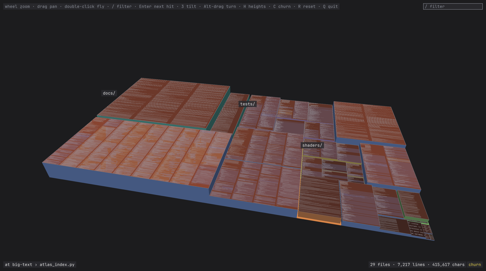

*big-text viewing itself: 29 files and about 7,200 lines tilted into 3D with the heights and the tint on, the most edited files ember, every roof carrying its code.*

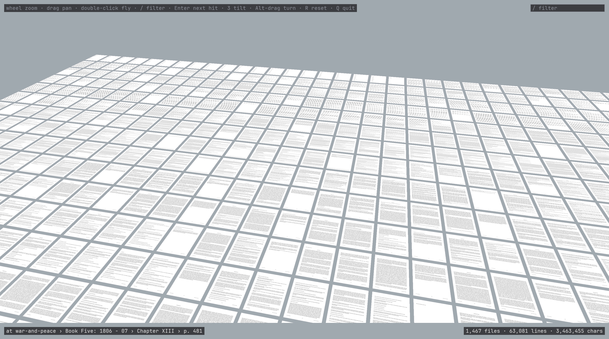

*The same viewer on War and Peace, Dobbie's example, in his colours and a book face: white pages on the blue-grey ground of his demo, Literata set by its own advances, 1,467 pages and 2.67 million glyphs as one grid in reading order, tilted, the near pages at the text LOD and the far rows at bars in the same frame.*

It shows three kinds of content, in this order of priority: text, images, 2D vector work. Each has an open-source lineage, and the levels of detail that tie them together have a fourth:

| Content | Lineage | Licence | What it contributes | Pinned as |
|---|---|---|---|---|
| Text | [Vector textures](https://wdobbie.com/post/gpu-text-rendering-with-vector-textures/) and [War and Peace](https://wdobbie.com/post/war-and-peace-and-webgl/) (Will Dobbie, 2016) | none published; reimplemented from the posts, no code or data used | The two-tier glyph design: outlines as quadratic bezier curves in a texture, ray-cast per pixel, crisp at any magnification; a mipmapped raster atlas below two texels per pixel; a whole book laid out once as one static vertex buffer | nothing to pin; the two posts are the reference |
| Text | [Slug](https://github.com/EricLengyel/Slug) (Eric Lengyel, 2017; [paper](https://jcgt.org/published/0006/02/02/)) | MIT or Apache-2.0; the patent dedicated to the public domain on 2026-03-17 | The robust vector shader: curves listed per band instead of per grid cell, roots chosen from the signs of the control points so no crossing is counted twice or missed, a box filter along two axis rays | `slug/` at be3c13e; its pixel shader translated into `shaders/vt_glyph.glsl` with the notice kept |
| Images | [big-picture](https://github.com/erik-larsen/big-picture) (Erik Larsen, 2026) | MIT | The camera and the budget: tile pyramid, virtual texturing, feedback pass, streaming under a fixed GPU footprint, mosaic layout from a folder tree | `big-picture/` |
| 2D vectors | [HEPR](https://github.com/soadzoor/Highly-Efficient-PDF-Renderer) (soadzoor, 2026) | MIT | Analytic stroke and fill shaders for PDF paths with stroke level of detail, a PDF parser, a greek tier for sub-pixel glyphs, search and selection over pre-laid-out text, WebGL2 and WebGPU backends | `hepr/` at c81c326 (0.1.29) |
| Levels of detail | [makepad](https://github.com/makepad/makepad) Studio code atlas (Rik Arends, 2026) | MIT (the repository's LICENSE, Makepad B.V.); its crates declare MIT OR Apache-2.0 | Semantic level of detail: file tile, kind bands, line bars, tokens, text, chosen by pixels per line; a retained GPU working set with a device-derived budget | not pinned; the levels of detail are reimplemented from the video and the public history |

The three lineages with code are pinned as submodules at the commit studied, so what this README says about them can be checked against the code; the pins are references, not dependencies, and nothing is copied out of them except Slug's pixel shader. Dobbie never published a repository, so his posts are the reference. The code atlas's own crates live in a private makepad repository; big-text reimplements the levels of detail from the public engine, the commit messages and the video, and reimplements Dobbie's tiers from his posts. HEPR credits Dobbie and keeps his raster tier, but its glyph shader loops over every curve of a glyph, which is why Slug and not HEPR is the text lineage.

## The idea in one paragraph

big-picture draws a gigapixel image with a fixed GPU budget by streaming tiles from a pyramid. Text breaks the pyramid: a downsampled page of code is grey mush, and a magnified tile is blurry. So big-text keeps the streaming and the camera but replaces the pyramid with levels of detail. Far away a file is a coloured tile. Closer it is one bar per line, coloured by token kind, which is what makes a codebase look like a die shot. Closer still it is real glyphs, drawn from a raster atlas while they are small and from bezier curves once they are large. Each file picks its LOD from its size in pixels, and the viewer streams only the LODs it can see.

## Vector text: Dobbie, Slug, and what big-text takes from each

The two glyph lineages are one technique with a ten-year gap.

| Date | Event |
|---|---|
| 2016-01-02 | Dobbie publishes the technique: quadratic outlines in a texture, a grid of curve lists per glyph, ray casting per pixel, an exact filter along four rotated rays, WebGL 1 on 2016 hardware |
| 2016-01-21 | War and Peace: the raster mip tier for minified text, 2.7 million glyphs as one static buffer |
| Fall 2016 | Lengyel develops Slug |
| 2017-03-27 | Slug provisional patent application; the grant, US 10,373,352 (2019-08-06), cites Dobbie's post as prior art |
| mid 2017 | The JCGT paper cites Dobbie as the closest published method and benchmarks against him, 5.2 ms against 1.3 ms for the same text after correcting for four rays versus two |
| 2026-03-17 | Lengyel dedicates the patent to the public domain and publishes the library's vertex and pixel shaders under MIT |

The patent never covered Dobbie's method. Its one independent claim is the root-selection rule: classify each control point by its sign relative to the ray, then decide from that classification which roots count. Dobbie selects roots by testing whether t lies in (0, 1), which is exactly the step the paper shows to be numerically fragile near shared endpoints and tangents, the cause of his sparkles. So Dobbie's shader was always free to reimplement, and the dedication unlocked only the fix. Everything else in Slug, bands included, was unclaimed or already public in Dobbie's grid.

What each is better at:

- **Slug's vector shader is better everywhere the vector shader is used.** It never double-counts a crossing, its bands hold any number of curves where Dobbie's cells hold eight, its two axis rays cost half of his four, and its bands are widened by half the largest expected pixel, so text stays correct at small sizes where Dobbie's fragment reads one cell and misses its neighbours' curves. His raster tier was the workaround for that.
- **Dobbie's two tiers are the only published answer to sub-legible text.** Slug's cost per pixel is the curve count of the band and its bands assume a smallest font size; a page thumbnail at a fraction of a pixel per glyph is outside it. A mipmapped raster atlas handles that regime correctly and almost for free, because trilinear filtering is the exact prefilter for a shrinking image. HEPR kept the tier for the same reason.
- **Dobbie's static document is a system design, not a shader.** Lay the corpus out once, keep it resident, draw a page as a vertex range, skip pages off screen. It is big-picture's streaming with a single tile, and it is what big-text does today.

So big-text keeps Dobbie's architecture and puts Slug inside its vector tier: bands, the sign-classification rule, the two-ray box filter. The handoff to raster sits where the measurement under Implementation puts it, 12 pixels per line, rather than at Dobbie's fixed two texels per pixel. Below the raster tier the levels of detail continue with line bars and tiles, the regime neither of them addressed, and the handoff between raster glyphs and line bars is the one open design question in this area.

## One framework, many corpora

The presentation layer is corpus-blind. Every corpus big-text intends to show bottoms out in one of three leaf payloads, and all of the expensive rendering lives in those:

| Leaf payload | Corpora | Renderers |
|---|---|---|
| Text | files of a repo, pages of a book, text of a PDF | the Slug vector tier, the Dobbie raster tier, line bars |
| Images | photos and other large images, images in a PDF | big-picture's tile pyramid and virtual texturing |
| 2D vectors | drawings in a PDF, layouts of a DXF | stroke and fill shaders with stroke level of detail from HEPR; [dxf-visual-spec](https://github.com/erik-larsen/dxf-visual-spec) supplies the DXF semantics |

A page of War and Peace and a file of Rust are the same thing to the text renderers; a DXF and a PDF floorplan are the same thing to the path renderers. Adding a corpus costs no new shader. What differs per corpus is three functions, not a rendering algorithm: the hierarchy (folder tree, chapter and page, year and month, layer and block), the layout (treemap for code, reading order for a book, mosaic for photos, sheets for DXF), and the aggregate colour of a node too small to show its contents (token-kind mix, average colour, layer colour). A corpus adapter supplies those three; the levels of detail, camera, budget, hit testing and fly-overs are shared. The viewer never learns which corpus it is showing. An adapter hands it a hierarchy, the leaves' content, a weight per leaf for the layout, an optional tint per leaf with a one-word label, its colour scheme and face, and the layout itself; everything the viewer draws, answers on hover or finds with the filter comes from those. A corpus carries its own look: code is the dark atlas in a monospace face, the book is white pages on the blue-grey ground of Dobbie's demo with black text in Literata, a proportional book face, every glyph placed by its own advance. Collections of books, repositories or drawings are hierarchies with documents as internal nodes and need nothing new. Everything is flat: one 2D plane and one camera, the 3D projection being a way of looking at that plane rather than a third kind of content.

The code adapter is deliberately no more than an indexer with a git pass. It has no symbol resolver, no dependency graph, no history browser: those belong to a code tool, and big-text is not one, it is the surface a code tool would draw on. What the code adapter contributes beyond the book adapter is a tokenizer, so the bars and blocks carry token kinds, item extents, so functions and types get outlines and names, and one number per file from git, the tint. No adapter interface gets written until three adapters exist: code and a book are built, and the book cost one indexer and one placement function (`book_index.py`, and the page grid in `atlas_layout.py`); photos and DXF are the real second and third.

## Install

1. Clone. The submodules are references, not dependencies: nothing is needed to run big-text on its own source or on a book.

```bash
git clone https://github.com/erik-larsen/big-text.git
cd big-text
```

2. Python 3.12 with the packages in `requirements.txt`, in a virtual environment: numpy, Pillow, PyOpenGL, glfw and fontTools.

```bash
python3 -m venv .venv
source .venv/bin/activate
pip install -r requirements.txt
```

3. A GPU and driver with OpenGL 3.3 core. Developed and measured on macOS with an M4; Linux with Mesa or vendor drivers should work and is untested; Windows is untested. The default face is bundled under `fonts/` with its OFL licence, and git is used only for the tint.

4. Check the install: the test opens a hidden window and compares the vector tier against Pillow.

```bash
./tests/test_vt_glyphs.py
```

There is no build step. The scripts run in place, and the build is generating an atlas from a corpus, the first two commands below.

## Run

Three steps: index a corpus, lay it out, view it. Everything generated lands under `data/`, which git ignores, and every step prints what it did and how long it took. The default example is big-text itself, 29 files and about 7,200 lines with this README among them, prepared in under a second:

```bash
./atlas_index.py . --out data/big-text_atlas
./atlas_layout.py data/big-text_atlas
./atlas_viewer.py data/big-text_atlas
```

The index step reads the tree's git history in the same pass, one `git log --numstat`, and writes each file's lines added and removed as its tint; `--no-git` skips it, and a tree that is not a checkout gets no tint. For scale, clone emscripten next to big-text and index the whole tree, 11,495 files and 2.80 million lines: 22 seconds to index, 20 of them the git pass over its 30,274 commits, 1.3 to lay out, 279 MB on the GPU:

```bash
git clone https://github.com/emscripten-core/emscripten.git ../emscripten
./atlas_index.py ../emscripten --out data/emscripten_atlas
./atlas_layout.py data/emscripten_atlas
./atlas_viewer.py data/emscripten_atlas
```

Glyphs from 12 device pixels per line come from the vector tier by default, crisp at any magnification; the first run builds its curve and band textures in a tenth of a second and caches them under `data/`, and `--no-vector-text` keeps the raster atlas at every size. `--goto path:line`, `--zoom PX_PER_LINE`, `--filter WORD`, `--step K`, `--proj 3d --tilt DEG --yaw DEG`, `--heights`, `--tint`, `--hover PATH:LINE:COL`, `--frames N --screenshot out.png`, `--shots DIR` and `--stats` script the viewer for screenshots and timing; `docs/shots/README.md` lists the commands that made every image here.

### The book

Dobbie's example, War and Peace, needs nothing beyond the install: no submodule, no git. There is no build step here either; the build is three commands, and the whole thing takes about a second:

```bash
./book_index.py --gutenberg 2600 --out data/war-and-peace_atlas
./atlas_layout.py data/war-and-peace_atlas
./atlas_viewer.py data/war-and-peace_atlas
```

1. `book_index.py` fetches Project Gutenberg ebook 2600 (3.4 MB) into `data/gutenberg/pg2600.txt` on the first run and reads it from there after, drops Gutenberg's header and footer, and splits the text on its headings: reflows the prose to Letter pages, every paragraph re-broken word by word to the line width that makes a page of 40 lines Letter-shaped inside its margins, measured in the book's own face (the contents list, verse and headings keep their lines), and splits it on its headings: `BOOK ONE: 1805` and the two epilogues open a part, `CHAPTER I` a chapter, every 40 lines of a chapter are a page, padded to 40, with a running footer under two blank lines, author, page number and title spaced across the page in the face's own widths, and chapter headings centred the same way. It writes `data/war-and-peace_atlas/index.npz` and `index.json`, the same index a source tree gets, with parts as directories and pages as files named `Book One: 1805/Chapter I/p. 17`, and the book's scheme, Dobbie's colours, white pages, black text, grey bars, his demo's blue-grey ground, and its face, Literata; and prints the counts: 18 parts, 366 chapters, 1,467 pages, 2.67 million glyphs, about a second.
2. `atlas_layout.py` sees `"corpus": "book"` in the index and lays the pages out in reading order instead of a treemap: one grid, as Dobbie's demo, every page one cell of one size in a gutter of 8 percent of its width, its text block inset by margins of 7.5 percent of the page's width, 9 percent of its height above and 3 below, the footer sitting in the bottom one, 58 pages across, the parts drawing nothing, and writes `layout.npz`, with lines as the book's one metric; `--book-layout parts` gives every part its own band of page rows instead. In 3D a book is one flat sheet, nothing extruded, the tilt just a way of looking at it. Add `--preview docs/shots/war-and-peace_layout.png` to render the result with Pillow without opening a window.
3. `atlas_viewer.py` opens the book fitted to the window, its text in Literata at every size, glyphs placed by their own advances, and the hints and panel in the monospace face. Everything in Controls works: `/` filters (`Natasha` finds 1,213 mentions on 310 pages), Enter flies to the next hit, `3` tilts the sheet (a book has no heights in 3D), hover names the part, chapter and page under the cursor. There is no tint, since a book has no commits.

The README's second image is the viewer scripted from the shell, and the opening pages are one flag away:

```bash
./atlas_viewer.py data/war-and-peace_atlas --proj 3d --tilt 55 --yaw 12 --goto "p. 481:1" --zoom 3 --frames 2 --no-hover --screenshot hero.png
./atlas_viewer.py data/war-and-peace_atlas --goto "p. 17:1" --zoom 11
```

Any Gutenberg plain text works the same way: `--gutenberg N` with its ebook number, or a path to a text file already on disk. A text whose parts and chapters are headed `BOOK`, `PART`, `VOLUME`, `EPILOGUE` or `PROLOGUE` and `CHAPTER` at the start of a line splits as War and Peace does; a text without headings becomes one part named after the corpus, its pages `name/p. 1` onward. `--page-lines` sets the page (40 by default), `--page-aspect` its shape (Letter, `612:792`), `--no-reflow` keeps Gutenberg's own line breaks, `--front` names the part before the first heading (`Front matter`), and `--name` the corpus. The text is normalised to ASCII, so accented names lose their accents and curly quotes come out straight; the Implementation section says exactly what is mapped.

## Controls

| Input | Action |
|---|---|
| Wheel | Zoom about the cursor, with a short glide |
| Left or right drag | Pan; the map follows the cursor |
| Hover | A light border on the file, a label with path, line and enclosing item |
| Double click | Fly to the extents of the file or directory under the cursor; a second double click there flies back to the view before |
| `/` or click the box | Type a filter: every file with a hit gets a yellow border, the rest dim, the panel lists the hits by file |
| `Enter` `]` `Down` / `[` `Up` | Fly to the next / previous hit; clicking a hit in the panel flies to it |
| `3` | The tilted projection on and off: the sheet in perspective, the near files at text and the far ones at bars |
| `Alt` + drag | Tilt (vertical) and turn (horizontal) the 3D camera; from 2D it switches to 3D |
| `H` | The heights on and off in 3D: files rise by their weight, directories are terraces; off by default |
| `C` | The tint on and off, when the corpus has one: for code, lines added and removed over the git history, in ember |
| `R` | Reset the view to the fitted map |
| `Escape` | Clear the filter |

## What it looks like

Every image is big-text viewing its own source; `docs/shots/README.md` has the command behind each, and `docs/shots/emscripten/` holds the same set on the whole emscripten tree, 11,495 files and 2.80 million lines, where the scale is the point.

The map fitted to the window. Every file is a rectangle wrapped into columns, the directories are bands in their own hue, and at this size the files sit on the line-bars LOD, one grey bar per line from indent to length.

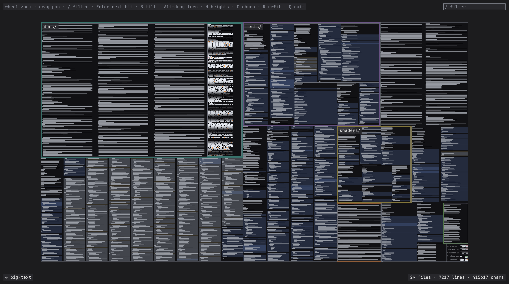

The four LODs, from the fitted map through 2, 4.5 and 16 device pixels per line: bars, token blocks with item outlines, then text.

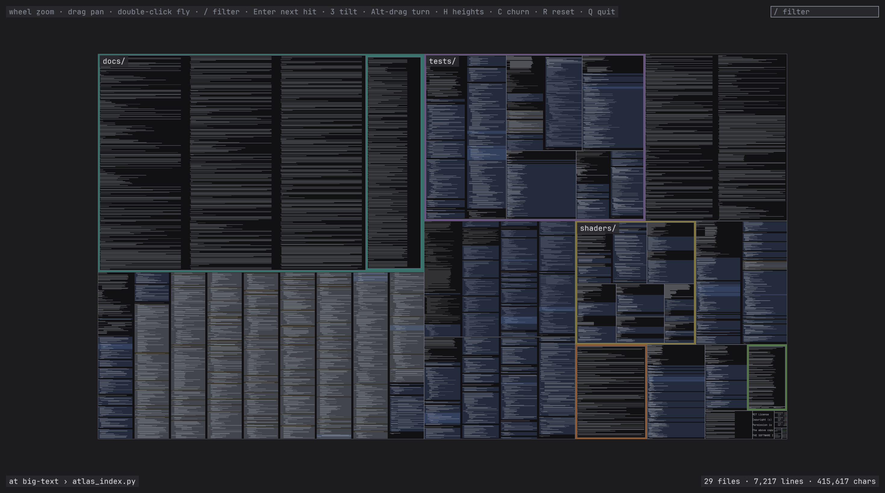
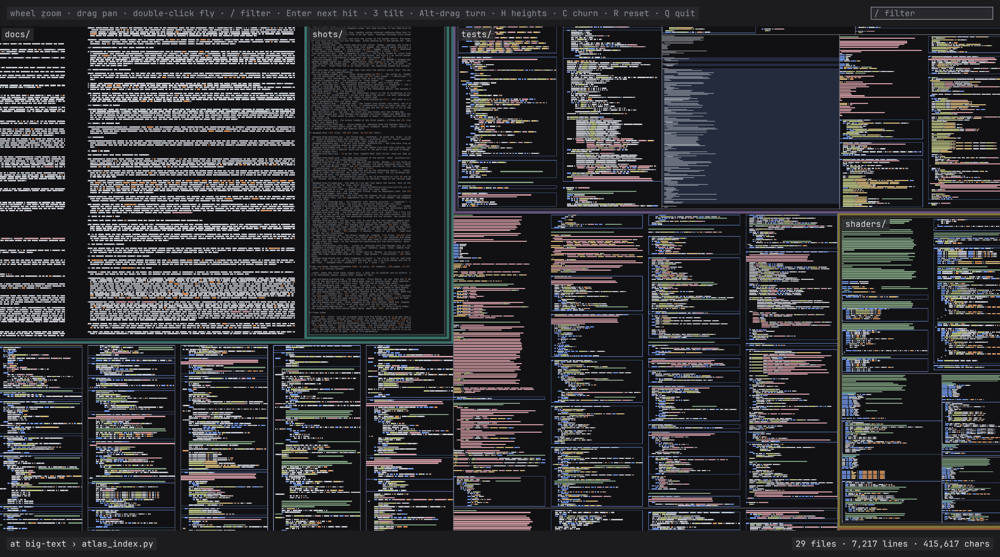
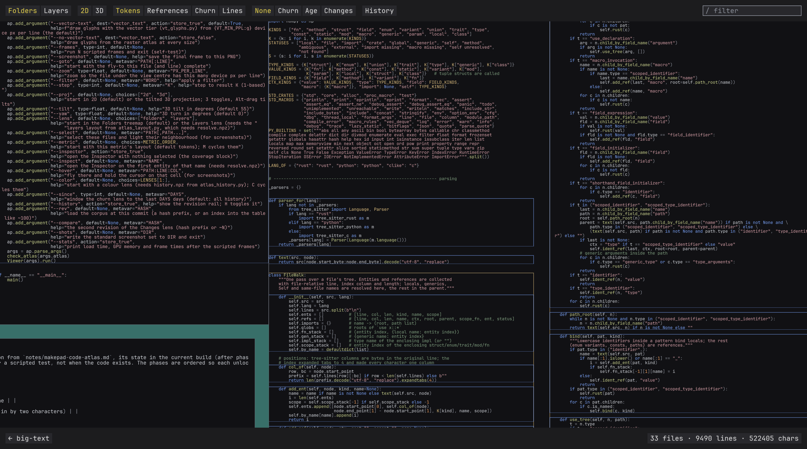

The filter `Viewer`: the five files that mention it outlined in yellow, the rest dimmed, the panel listing the 14 hits by file; then the view after stepping to the first hit, filled yellow at text zoom.

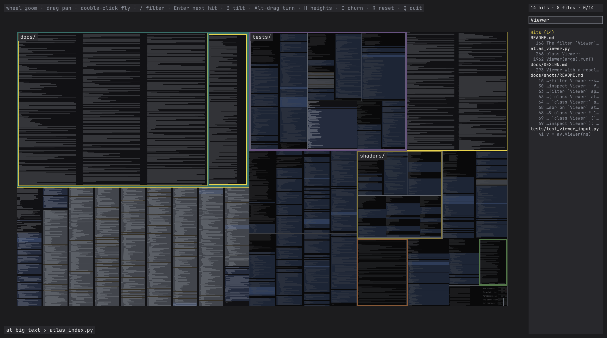
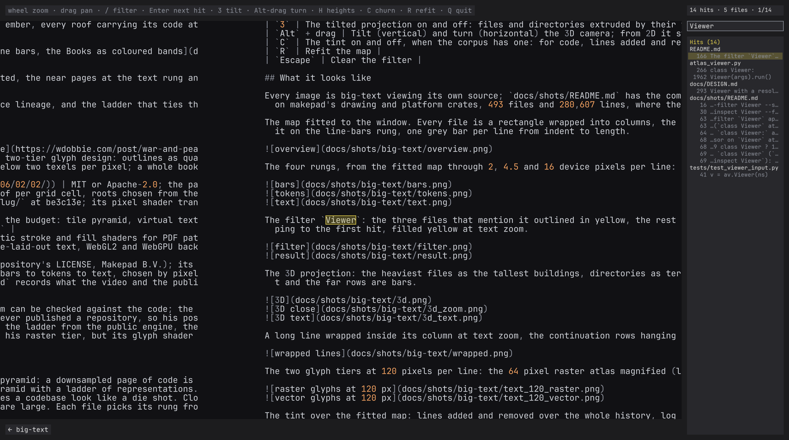

The 3D projection with the heights on: the heaviest files as the tallest buildings, directories as terraces, the levels of detail still drawn on every roof so the near rows are text and the far rows are bars.

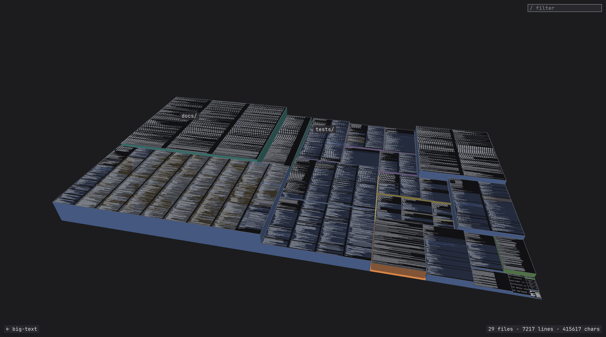
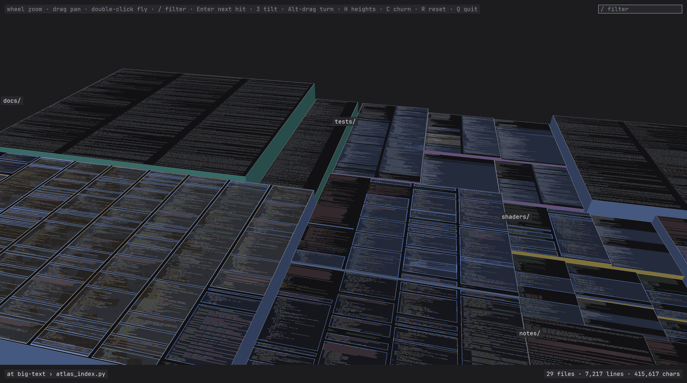
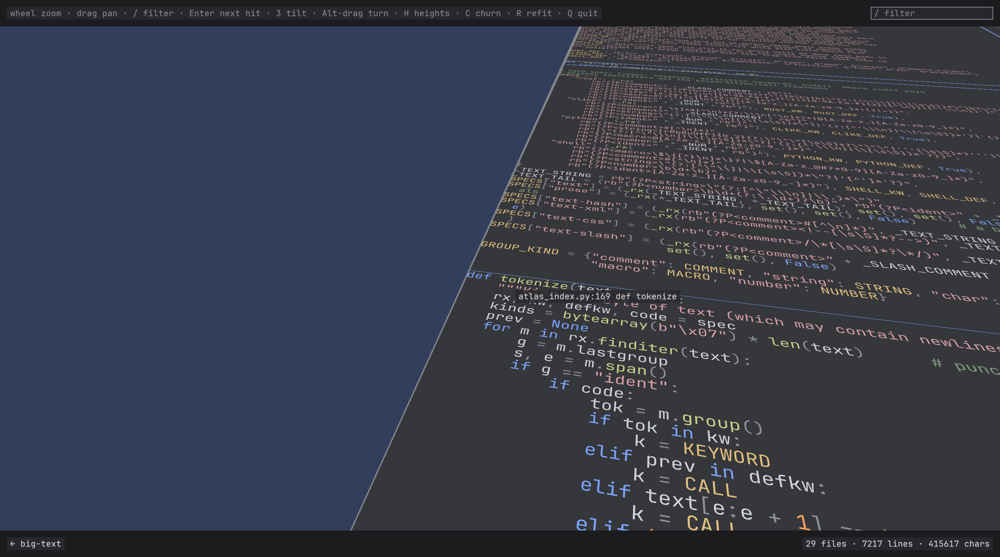

A long line wrapped inside its column at text zoom, the continuation rows hanging in by two characters: this README's longest paragraph.

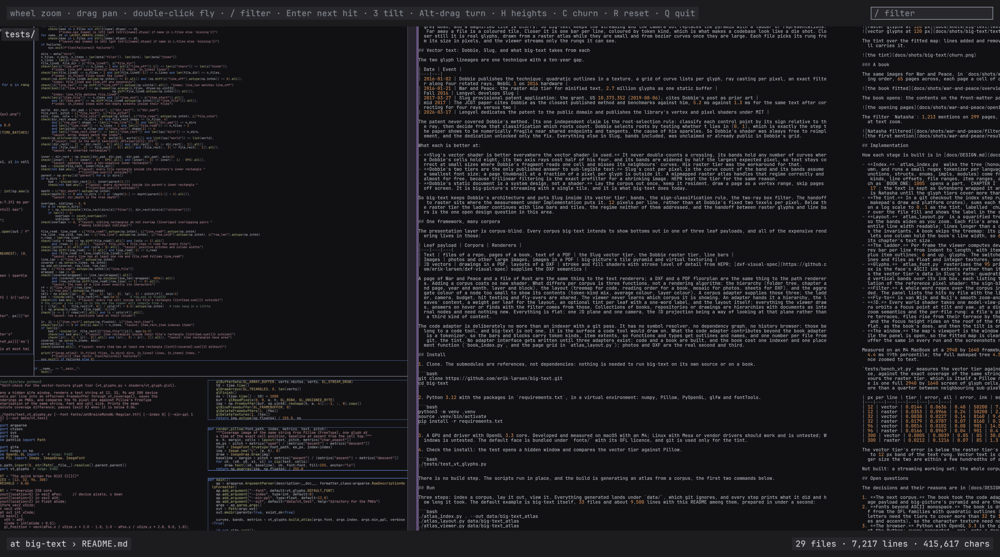

The two glyph tiers at 120 pixels per line: the 64 pixel raster atlas magnified (left) and the vector tier (right).

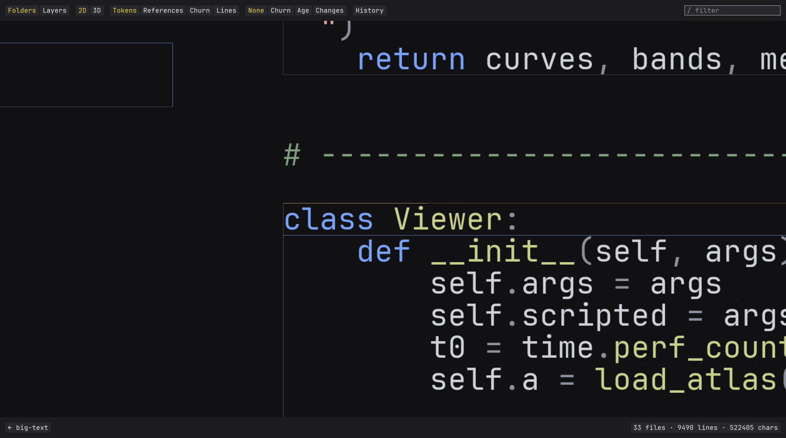
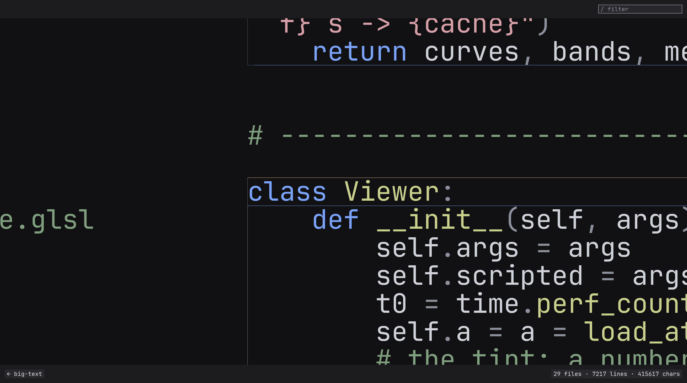

The tint over the fitted map: lines added and removed over the whole history, log scale, in ember. The bars and glyphs are untouched; only the file fill carries it.

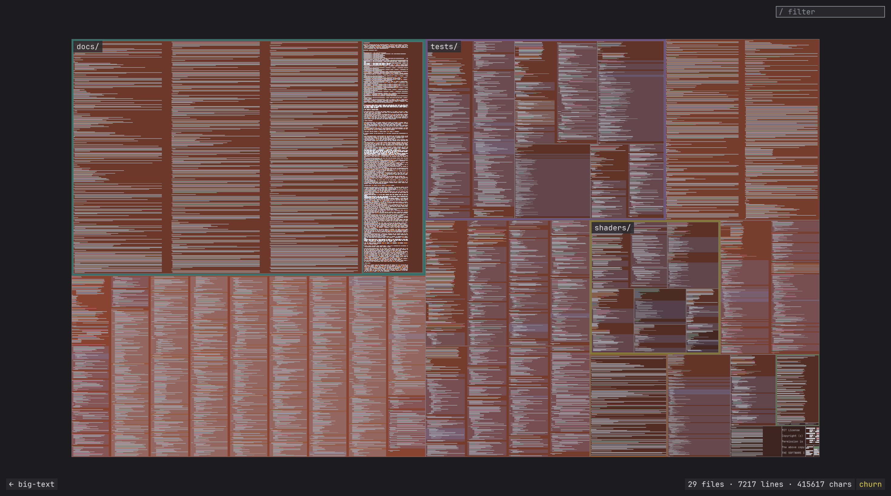

### A book

The same images for War and Peace, in `docs/shots/war-and-peace/`. The map fitted: one grid of 1,467 pages in reading order, 58 across, each page a white cell of one size in a grey gutter, the text the pale grey of its averaged ink.

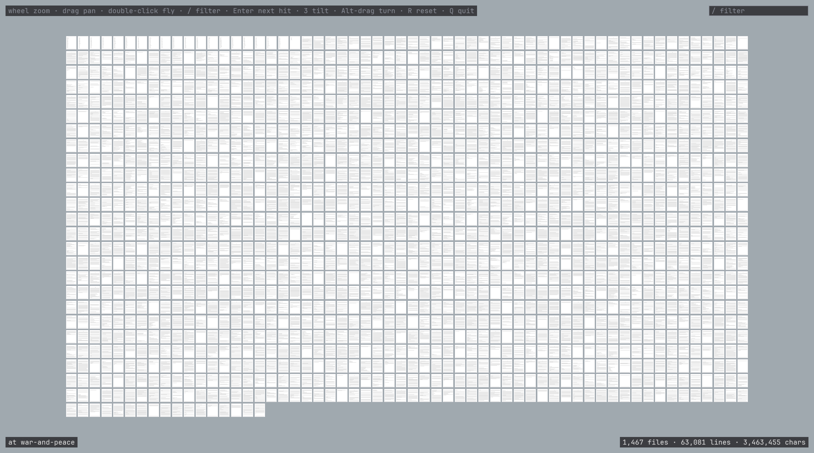

The book opens: the contents on the front-matter pages, then `Book One: 1805` and the first line of Chapter I, at 11 pixels per line.

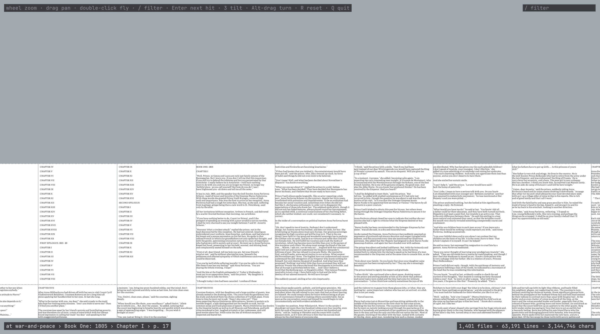

The filter `Natasha`: 1,213 mentions on 310 pages, every page with one outlined in yellow, and the fly-to landing on the first, the hit filled yellow at text zoom.

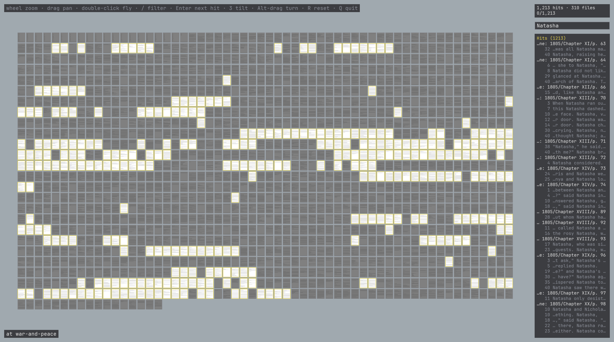
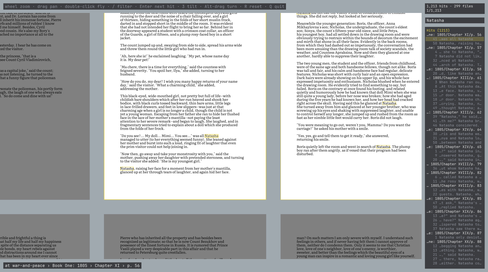

## Implementation

How each stage is built is in [docs/DESIGN.md](docs/DESIGN.md). The short version:

- **Index.** `atlas_index.py` walks the tree (honouring `.gitignore`, skipping binaries and submodules), expands tabs, maps every character to one column, and runs a small regex tokenizer per language family (Rust, C-like, Python, shell, plain) that gives every character one of ten kinds. Items (functions, structs, enums, impls, modules) come from regexes with brace or indentation matching. The output is a handful of numpy arrays: characters, kinds, line offsets, file ranges, item ranges, and the tint. `book_index.py` writes the same index from a Project Gutenberg text: a heading line such as `BOOK ONE: 1805` opens a part, `CHAPTER I` a chapter, and every 40 lines of a chapter are a page, the file, named `Book One: 1805/Chapter I/p. 17`; the prose is reflowed to the page's line width in the book's face and normalised to ASCII (curly quotes straight, the em dash two hyphens, accents stripped, so Natásha is Natasha until the glyph tiers cover more than ASCII), and words are the identifier kind, with no string literals and no items.
- **The scheme.** An index may carry a `scheme`: the ground, the page (the file fill), the bar colour, the ten kind colours, the five item colours, and a face under `fonts/`; the viewer takes what is given over the code atlas's defaults and hands the colours to the shaders as uniforms. The book's is Dobbie's demo: pages as white quads on a `#a0a9af` ground, text black, the bands in the ground's own colour so the parts draw nothing, Literata for the face, and an ink of 17 percent for the bars and 22 for the word blocks, the text's own mean ink measured from the atlas over the book's letters, so nothing steps at a cut and a page seen from afar reads as the pale grey of averaged text, as his do, where code keeps its bright bars. The scheme's `ink` is the bars' alpha far and near and the word blocks'. His own face was Centaur, read from the embedded fonts of the demo's source PDF; Centaur is Monotype's, and Literata is the book serif made for reading on screens under the OFL.
- **Proportional text.** When the face's advances differ, the layout measures every line in line heights by summing its glyphs' advances, sizes columns and wraps by width, and writes each glyph's x within its row (`char_x`) and each row's width; the viewer then draws the tokens and text LODs with one instanced quad per glyph (`shaders/glyph.glsl`) placed by that x and sized by its advance, from the same raster atlas and vector tier, and finds the glyph under the cursor or a hit by the same offsets. A scheme may ask for set type: a line with more of its paragraph after it is stretched to the margin by widening its word gaps evenly, in those same x's, and for a leading, the line box stretched over the ink extents so a book has air between its lines (1.3 for the book). Bars, and every LOD of a monospace corpus, keep the per-line draw. Code stays on the monospace grid.
- **The tint.** In a git checkout the index step runs one `git log --numstat` over the indexed directories (20 seconds for emscripten's 30,274 commits, under a second for big-text's), sums each file's lines added and removed, a rename counting as a removal and an addition, and writes the sums on a log scale to 0..1 as the tint, labelled `churn`. The viewer knows only that a leaf has a number in 0..1 and a label: it maps the number to ember over the file fill and shows the label in the status line. A book writes no tint.
- **Layout.** `atlas_layout.py` is a squarified treemap over the directory tree with padding per level, sized to about two lines of the directory's own text, which the viewer draws as the directory band: a few pixels wide at most, so the bands stay thin at every zoom, a hairline at the fit and a gutter of two lines once the text is legible. Each file's area is its weight, tokens for code. Each file is wrapped into as many equal columns as keep a 90th-percentile line width readable; lines longer than a column wrap inside it, continuation rows hanging in by two characters. `tests/check_layout.py` checks the invariants. A book skips the treemap: one grid of pages in reading order, every page one cell of the size that lets one column hold the book's line width inside the page's margins, in a gutter, so 58 pages across for War and Peace, and every page pitched as a full page so a short last page keeps its chapter's text size; `--book-layout parts` gives every part its own band of page rows instead.
- **The levels of detail.** Per frame the viewer computes device pixels per line for every file and picks a LOD: under 1, sampled one-pixel bars; 1 to 3, one grey bar per line from indent to length, with items as filled bands in their kind colour beneath; 3 to 6, one block per character in its kind colour plus item outlines; 6 and up, glyphs. The switches are hard cuts, as in the video. Everything is resident: characters and kinds as 8-bit textures, lines and files as float and integer textures, one instanced quad per line drawn per run of visible files.
- **Glyphs.** `atlas_font.py` rasterises the 95 printable ASCII glyphs of a face into a mipmapped atlas; the line box is the face's ASCII ink extents rather than its OS/2 box, so a change of face does not change the proportions of the layout. A proportional face gets cells as wide as its widest glyph, each glyph drawn from the left, and its advances travel with the atlas; the UI always draws from the bundled monospace face's atlas. `vt_glyphs.py` builds the vector tier's data in Slug's form: quadratic outlines from fontTools as float32 control points in a curve texture, and per glyph horizontal and vertical bands over its ink box, each listing the curves that cross it sorted for the shader's early exit. `shaders/vt_glyph.glsl` is a GLSL translation of the reference pixel shader: the sign-bit root rule, two axis rays with a box filter, the weighted combination.
- **Filter.** A whole-word regex over the corpus in a thread, chunked so the frame loop keeps running, with mentions inside comments and strings excluded. The panel lists the hits by file with the line each sits on, the status line counts hits and files, and stepping flies from one to the next.
- **Fly-to** is van Wijk and Nuij's smooth zoom-and-pan, which zooms out and back in between distant places. Stepping through hits, clicking a hit and double-clicking a rectangle all use it; the double click remembers the view it left, and a second double click at the extents returns there.
- **3D.** Every world shader takes one model-view-projection matrix, orthographic in 2D and perspective in 3D, so the flat view is unchanged. The camera orbits a focus point at tilt and yaw, at a distance chosen so one world unit at the focus is the same number of pixels as in 2D, which keeps the zoom semantics and the per-file LOD: a file's pixels per line is foreshortened by its depth, so one frame has text near and bars far. By default nothing rises and the tilt is only a way of looking at the sheet; with the heights on (`H`, `--heights`) directories are terraces, files rise from their terrace by the square root of their weight, an instanced wall pass draws the sides shaded by which way they face, and the focus height rides on the roof of the file under the centre so a close camera never ends up inside a building. A layout can declare itself flat, as the book's does, and then the heights stay off.
- **The window.** The map's viewport is the window minus a top strip (the input hints and the filter box), a bottom strip (the crumb trail, which names the file under the view centre, and the status) and the right column while the panel is open, so the fitted map is clear of every control. The window is sized to the screen's work area explicitly, which makes the framebuffer the same in every run and the screenshots reproducible.

Measured on an M4 MacBook at a 2940 by 1640 framebuffer, `--frames 300 --stats` over the scripted zoom from fit to text: big-text 1.4 ms mean and 3.9 ms 99th percentile; emscripten 5.5 and 25 ms, the tail being the fitted view where all 2.8 million lines are visible, and 3.3 ms once zoomed to text.

`tests/bench_vt.py` measures the vector tier against the raster tier (the 64 px mipmapped atlas sampled as the text LOD samples it) on the bundled face, against the exact coverage of the same string: Pillow at eight times the size, box-filtered down, since a hinted reference at the target size favours the raster tier, which is itself a Pillow render. Error is the mean absolute coverage difference over the whole image and over ink pixels; time is one full 2940 by 1640 screen of glyph cells, the best of five batches of fifty draws; sparkle is the number of pixels whose coverage jumps by more than a quarter between neighbouring sub-pixel offsets 0.1 px apart, which a one-pixel box filter cannot do on an edge.

| px per line | tier | error, all | error, ink | ms per screen | cells per screen | sparkle mean | sparkle max |
|---|---|---|---|---|---|---|---|
| 12 | vector | 0.0144 | 0.0636 | 0.48 | 58208 | 7.6 | 16 |
| 12 | raster | 0.0353 | 0.0966 | 0.24 | 58208 | 2.6 | 9 |
| 32 | vector | 0.0038 | 0.0227 | 0.14 | 8160 | 9.4 | 19 |
| 32 | raster | 0.0179 | 0.0787 | 0.07 | 8160 | 0.7 | 3 |
| 96 | vector | 0.0014 | 0.0102 | 0.08 | 901 | 14.5 | 24 |
| 96 | raster | 0.0166 | 0.0967 | 0.04 | 901 | 0.4 | 5 |
| 300 | vector | 0.0005 | 0.0039 | 0.05 | 85 | 30.8 | 49 |
| 300 | raster | 0.0212 | 0.1216 | 0.07 | 85 | 1.3 | 13 |

The vector tier's error is below the raster tier's even at 12 px, so the handoff `VT_MIN_PPL` is 12 px per line and the raster atlas serves only the 6 to 12 px band of the text LOD. Vector text is on by default: at 12 px it costs 0.48 ms per screen against the raster tier's 0.24, and at every larger size the two are within a few hundredths of a millisecond.

Not built: a streaming working set; the whole corpus is resident, which is fine to a few million lines.

## Open questions

The decisions and their reasons are in [docs/DESIGN.md](docs/DESIGN.md). Open:

1. **The next corpus.** The book took the code adapter with pages as files and reading order as the layout, and cost no shader; photos exercise the image payload and big-picture's pyramid and are the first real test of the adapter split. Proposal: photos, then DXF.
2. **Fonts beyond ASCII.** The book is drawn in Literata, reflowed to its pages, its accents stripped. The accented letters need the tiers to cover more than 32 to 126: the whole of War and Peace fits in one byte per character (Windows-1252 covers its quotes, dashes and accents), so the character texture need not change.
3. **The browser.** Python with OpenGL 3.3 is the prototype; the browser is the target. The contract for getting there is the files and the shaders, not the Python: every generated `.npz` gets a documented binary layout, and every shader stays within GLSL ES 3.0 (texelFetch and integer samplers in, geometry shaders and bindless out), so a WebGL2 viewer reads the same atlases and links the same shaders. WebGPU later, from the same data.
4. **Budget and eviction.** Per-file instance ranges under a byte budget for text and big-picture's pages for images; whether one budget covers both. Built only once a corpus needs it.
5. **The handoff from raster glyphs to line bars.** Where a pixel starts to cover several glyphs and per-glyph quads overdraw: a hard cut at a pixels-per-line threshold as today, a blend, or whole lines cached as texture rows first. The one place the levels of detail are not yet designed, and the same problem in all three payloads.

## Licences

What big-text reuses, with the licence and the way it is reused: pin (a submodule at a commit, the upstream licence applying inside it), translate (code ported with the upstream notice kept), or reimplement (only the published description used, no code). [THIRD_PARTY_NOTICES](THIRD_PARTY_NOTICES) carries the notices.

| Part | Author, licence | How it is reused |
|---|---|---|
| big-picture | Erik Larsen, MIT | pin |
| makepad (public engine) | Makepad B.V., MIT by the repository's LICENSE; its crates declare MIT OR Apache-2.0 in their Cargo.toml, and the vendored libraries under `libs/` carry their own | reimplement: the levels of detail from the video and the commit messages, its private crates not used |
| Slug | Eric Lengyel, MIT or Apache-2.0; patent US 10,373,352 dedicated to the public domain 2026-03-17 | pin at be3c13e; the pixel shader translated to GLSL in `shaders/vt_glyph.glsl` with the notice kept. The 2017 JCGT supplemental GLSL is under the journal's terms and is not used |
| HEPR | soadzoor, MIT | pin at c81c326 (0.1.29); its stroke and fill shaders will be translated with their notices when the vector work starts |
| Dobbie's technique, formats and tiers | Will Dobbie, 2016, blog posts, no licence published | reimplement from the posts; no code or data of his is used |
| emscripten | the Emscripten authors, MIT or University of Illinois/NCSA | the scale example's corpus, cloned by the reader next to big-text; nothing of it is copied, and only screenshots of it are committed |
| JetBrains Mono NL | JetBrains, OFL 1.1 | pin: `fonts/JetBrainsMonoNL-Regular.ttf` with `fonts/OFL.txt` and `fonts/AUTHORS.txt`; the atlases the viewer builds from it are embeddings in the OFL's sense |
| Literata | the Literata Project Authors, OFL 1.1 | pin: `fonts/Literata-Regular.ttf`, the Regular instance at the 12 pt optical size cut from the variable font of release 3.103 with fontTools, with `fonts/Literata-OFL.txt` and `fonts/Literata-AUTHORS.txt`; the book's face |
| War and Peace | Leo Tolstoy, Maude translation, public domain via Project Gutenberg (ebook 2600) | the book corpus: `book_index.py --gutenberg 2600` fetches it into `data/gutenberg/` |

The default face, code's and the UI's, is JetBrains Mono NL Regular: OFL, TrueType with quadratic outlines so the vector tier converts nothing, and legible at the small sizes the levels of detail spend most of their time at. The book's is Literata Regular, also TrueType with quadratic outlines. Its OS/2 line box carries 1.32 em of leading, which would shrink every glyph at a given pixels per line, so the line box is defined as the face's ASCII ink extents, 1.05 em. `--font` takes any face on the machine; nothing generated from a font is committed.

## Layout

```
big-text/
  README.md                    this file
  requirements.txt             the Python packages (pip install -r)
  LICENSE, THIRD_PARTY_NOTICES MIT for big-text; what is reused from whom, and how
  docs/DESIGN.md               how each stage is built and why
  docs/shots/                  screenshots and the commands that made them
  atlas_index.py               source tree -> data/<name>_atlas/index.npz + index.json, the git churn as the tint
  book_index.py                Project Gutenberg text -> the same index: parts, chapters, Letter pages of 40 reflowed lines
  atlas_layout.py              index -> layout.npz
  atlas_font.py                monospace font -> raster glyph atlas
  vt_glyphs.py                 the vector glyph tier's curve and band textures (Slug's form)
  atlas_viewer.py              the viewer
  shaders/                     GLSL 330, one file per program (dir, file, line, glyph, rect, text, wall, vt_glyph)
  tests/                       layout invariants, viewer input driven by synthetic input, vector glyph accuracy, the tier measurement (bench_vt.py)
  fonts/                       JetBrains Mono NL and Literata, each with its OFL licence
  data/                        generated atlases, glyph caches and fetched books (gitignored)
  big-picture/, hepr/, slug/   submodules, pinned
```
