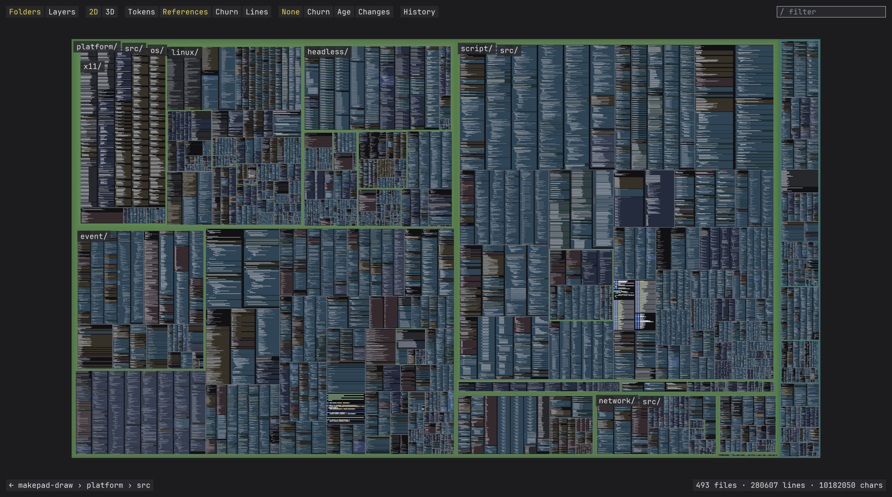
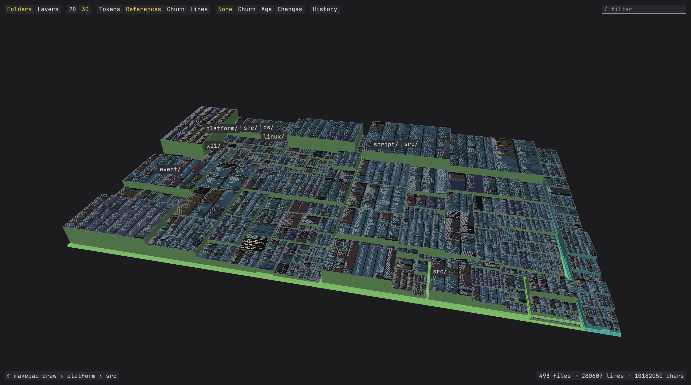
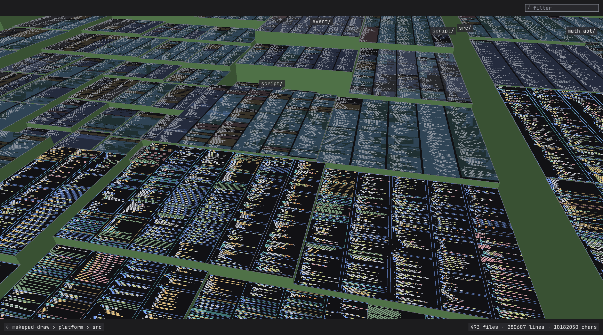
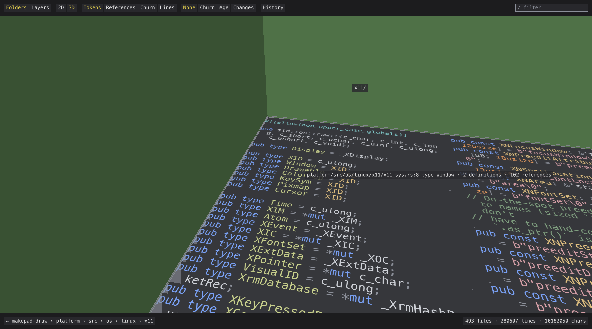
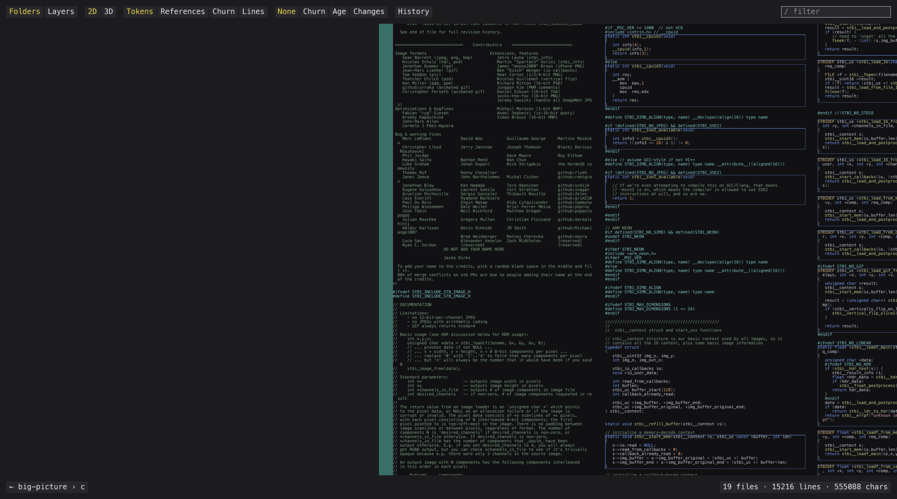
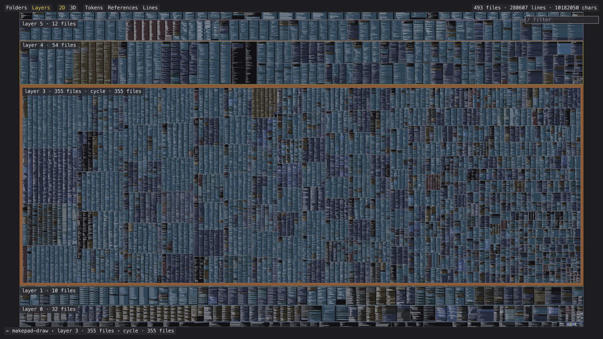
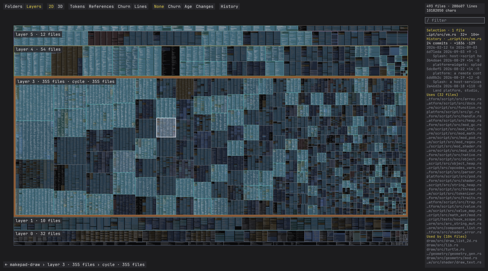

# big-text

Draft. This README is the design document; nothing here is settled until we have gone through it together.

big-text is the text-scale sibling of [big-picture](https://github.com/erik-larsen/big-picture): view millions of lines of source code, or a whole book, as one continuous surface. Zoom out and a codebase looks like a circuit board; zoom in and every glyph is crisp. No page turns, no mode switches, one camera.

It shows three kinds of content, in this order of priority: text, images, 2D vector work. Each has an open-source lineage that big-text builds on, and the ladder that ties them together has a fourth:

| Content | Lineage | What it contributes | Where |
|---|---|---|---|
| Text | Vector textures and War and Peace (Will Dobbie, 2016) | The two-tier glyph design: outlines stored as quadratic bezier curves in a texture and ray-cast per pixel, so text is crisp at any magnification; a prerendered mipmapped atlas that takes over below two texels per pixel; a whole book laid out once and drawn as one static vertex buffer with per-page ranges | `dobbie/` (his demos, fetched for parity tests only; see Copyright path) |
| Text | Slug (Eric Lengyel, 2017; public domain since 2026) | The robust vector shader: curves listed per horizontal and vertical band instead of per grid cell, roots selected by classifying control-point signs so no crossing is ever counted twice or missed, an exact box filter along two axis rays, and a vertex shader that dilates each glyph quad by exactly the pixel footprint | Not vendored; the MIT reference shaders are at [EricLengyel/Slug](https://github.com/EricLengyel/Slug), the paper at [JCGT 6(2)](https://jcgt.org/published/0006/02/02/) |
| Images | big-picture (Erik Larsen, 2026) | The camera and the budget: tile pyramid, virtual texturing, feedback pass, streaming with a fixed GPU footprint, mosaic layout from a folder tree, hover and click on the manifest, the globe | `big-picture/` (submodule, pinned) |
| 2D vectors | HEPR (soadzoor, 2026) | Analytic stroke and fill shaders for PDF paths with stroke level of detail, a PDF parser with no pdf.js dependency, a greek tier of solid squares once a glyph is under half a pixel tall, search and selection over pre-laid-out text, and a cached document container; WebGL2 and WebGPU backends of the same scene | `hepr/` (submodule, pinned at c81c326, release 0.1.29, 2026-09-08) |
| The ladder | Studio code atlas (Rik Arends, makepad, Sep 2026) | Semantic level of detail: one ladder from file tile to kind bands to line bars to tokens to text, chosen by pixels per line; a retained GPU working set with a device-derived budget; label layout on worker threads | `makepad/` (submodule, pinned) plus `notes/makepad-code-atlas.md` |

HEPR credits Dobbie and keeps his raster tier, so it is also the nearest existing system to what big-text is for text; its own glyph shader loops over every curve of a glyph with no grid or bands, which is why Slug and not HEPR is the text lineage. The code atlas's own crates (code_graph, code_atlas, code_view) are in a private makepad repo; what we have is the public engine underneath it and the commit messages that describe the design, and big-text reimplements the ladder rather than porting their code. The same rule applies to Dobbie: the format and the tiers are his, the code will be ours.

Corpora are separate from lineages. [dagcmp](https://github.com/erik-larsen/dagcmp) (Erik Larsen, 2026, MIT, `dagcmp/` submodule) scans a whole NTFS volume from the Master File Table in seconds and gives every node of the tree an aggregate and a compare status; it is the adapter for a filesystem as a corpus, not a way of drawing one.

## The idea in one paragraph

big-picture draws a gigapixel image with a fixed GPU budget by streaming tiles from a pyramid. Text breaks the pyramid: a downsampled page of code is grey mush, and a magnified tile is blurry. So big-text keeps the streaming and the camera but replaces the pyramid with a ladder of representations. Far away a file is a coloured tile. Closer it is one bar per line, coloured by token kind, which is what makes a codebase look like a die shot. Closer still it is real glyphs, drawn from a raster atlas while they are small and from bezier curves once they are large. Each file picks its rung from its size in pixels, and the viewer streams only the rungs it can see.

## Vector text: Dobbie, Slug, and what big-text takes from each

The two glyph lineages are one technique with a ten-year gap, and the record is worth stating plainly because the commercial telling omits half of it.

| Date | Event |
|---|---|
| 2016-01-02 | Dobbie publishes the technique: quadratic outlines in a texture, a grid of curve lists per glyph, ray casting per pixel, an exact filter along four rotated rays, WebGL 1 on 2016 hardware |
| 2016-01-21 | War and Peace: the raster mip tier for minified text, 2.7 million glyphs as one static buffer |
| Fall 2016 | Lengyel develops Slug |
| 2017-03-27 | Slug provisional patent application; the grant, US 10,373,352 (2019-08-06), cites Dobbie's post as prior art |
| mid 2017 | The JCGT paper: cites Dobbie as the closest published method and benchmarks against him, 5.2 ms against 1.3 ms for the same text after correcting for four rays versus two |
| 2026-03-17 | Lengyel dedicates the patent to the public domain and publishes the library's vertex and pixel shaders under MIT |

The patent never covered Dobbie's method. Its one independent claim is the root-selection rule: classify each control point by its sign relative to the ray, then decide from that classification which roots count. Dobbie selects roots by testing whether t lies in (0, 1), which is exactly the step the paper shows to be numerically fragile near shared endpoints and tangents, the cause of his sparkles. So Dobbie's shader was always free to reimplement, and the dedication unlocked only the fix. Everything else in Slug, bands included, was unclaimed or already public in Dobbie's grid.

What each is better at, from reading both shaders rather than measuring them:

- **Slug's vector shader is better everywhere the vector shader is used.** It never double-counts a crossing; its bands hold any number of curves where Dobbie's cells hold eight; its two axis rays with an exact box filter cost half of Dobbie's four rotated rays; and its preprocessor widens each band by half the largest expected pixel, so text stays correct down to small legible sizes, where Dobbie's fragment reads one cell and misses the curves of its neighbours once the pixel outgrows the cell. Dobbie's raster tier was the workaround for that; Slug fixed it in the vector path.
- **Dobbie's two tiers are the only published answer to sub-legible text.** Slug's cost per pixel is the curve count of the band, and its bands are sized for a design-time smallest font. A page thumbnail at a fraction of a pixel per glyph is outside it. A mipmapped raster atlas handles that regime correctly and almost for free, because trilinear filtering is the exact prefilter for a shrinking image. HEPR kept Dobbie's tier for the same reason.
- **Dobbie's static document is a system design, not a shader.** Lay the corpus out once, keep it resident, draw a page as a vertex range, skip pages off screen. It is the degenerate case of big-picture's streaming with a single tile, and it is what big-text does today.

So big-text keeps Dobbie's architecture and replaces the inside of its vector tier with Slug: bands, the sign-classification rule, the two-ray box filter, dynamic dilation. That also moves the handoff to raster from Dobbie's fixed two texels per pixel to wherever the cost crossover is. Below the raster tier the ladder continues with line bars and tiles, which is the regime neither of them addressed and where the overdraw shimmer Dobbie named as his open problem lives. The handoff between raster glyphs and line bars is the one open design question in this area.

## One framework, many corpora

The presentation layer is corpus-blind. Every corpus that big-text intends to show bottoms out in one of three leaf payloads, and all of the expensive rendering lives in those:

| Leaf payload | Corpora | Renderers |
|---|---|---|
| Text | files of a repo, pages of a book, text of a PDF | the Slug vector tier, the Dobbie raster tier, line bars |
| Images | photos and other large images, images in a PDF | big-picture's tile pyramid and virtual texturing |
| 2D vectors | drawings in a PDF, layouts of a DXF | stroke and fill shaders with stroke level of detail from HEPR; [dxf-visual-spec](https://github.com/erik-larsen/dxf-visual-spec) supplies the DXF semantics |

A page of War and Peace and a file of Rust are the same thing to the text renderers; a DXF and a PDF floorplan are the same thing to the path renderers. Adding a corpus costs no new shader. What differs per corpus is the middle of the ladder, and it is three functions, not a rendering algorithm: the hierarchy (folder tree, chapter and page, year and month, layer and block), the layout (treemap for code, reading order for a book, mosaic for photos, sheets for DXF), and the aggregate colour of a node too small to show its contents (token-kind mix, average colour, layer colour). A corpus adapter supplies those three; the ladder, camera, budget, hit testing and fly-overs are shared. Collections (many books, many repos, many drawings) are hierarchies with documents as internal nodes and need nothing new. Everything is flat: one 2D plane, one camera over it, with the 3D projection as a way of looking at that plane and not a third kind of content.

The rule for keeping this honest: no adapter interface until three adapters exist. Code is built; a book is nearly the same adapter; photos are the real second one and DXF the third.

## Build

Python 3.12 with numpy, Pillow, PyOpenGL, glfw, fontTools and tree-sitter with its Rust, Python and C grammars (`pip install numpy Pillow PyOpenGL glfw fonttools tree-sitter tree-sitter-rust tree-sitter-python tree-sitter-c`), an OpenGL 3.3 capable GPU, and a monospace font. On macOS the default is Menlo; on Linux pass `--font /usr/share/fonts/truetype/dejavu/DejaVuSansMono.ttf` to `atlas_viewer.py` and `atlas_layout.py`. The submodules are only needed as corpora: `git submodule update --init big-picture` is enough to try it, `makepad` adds 3.7 million lines.

## Run

Four steps: index a source tree, resolve its names, lay it out, view it. Everything generated lands under `data/`, which git ignores. The resolve step is optional; without it the filter is a plain word search and there is no Inspector.

```bash
./atlas_index.py big-picture
./atlas_resolve.py data/big-picture_atlas
./atlas_layout.py data/big-picture_atlas
./atlas_viewer.py data/big-picture_atlas
```

That is 19 files and 15,216 lines, indexed and laid out in well under a second. For something that looks like the video, index makepad's drawing and platform crates together, 493 files and 280,607 lines, or the whole makepad tree, 7,145 files and 3.67 million lines (4 seconds to index, 0.4 to lay out, 380 MB on the GPU):

```bash
./atlas_index.py makepad/draw makepad/platform --out data/makepad-draw_atlas
./atlas_resolve.py data/makepad-draw_atlas
./atlas_layout.py data/makepad-draw_atlas
./atlas_viewer.py data/makepad-draw_atlas
```

`--vector-text` switches the glyphs above 40 device pixels per line to the Dobbie vector tier (crisp at any magnification; the first run builds the curve atlas in about two seconds). `--goto path:line`, `--zoom PX_PER_LINE`, `--filter WORD`, `--step K`, `--frames N --screenshot out.png`, `--shots DIR` and `--stats` script the viewer for screenshots and timing; `docs/shots/README.md` lists the commands that made the images below.

## Controls

| Input | Action |
|---|---|
| Wheel | Zoom about the cursor, with a short glide |
| Left or right drag | Pan; the map follows the cursor |
| Hover | Light fill on the file, a label with path, line and enclosing item |
| `/` or click the box | Type a filter: every file with a hit gets a yellow border, the rest dim, the panel lists definitions then references |
| `Enter` `]` `Down` / `[` `Up` | Fly to the next / previous result |
| Click a result | Fly to it |
| Click a symbol at text zoom | Select it in the Inspector: kind, definition, scope, every reference |
| `I` / `Tab` | Open or close the Inspector / switch between Inspector and Results |
| Toolbar or `M` | Switch the area metric: Tokens, References, Lines (a hard cut to another layout) |
| `3D` button or `3` | The tilted projection: files and directories extruded by the current metric |
| `Layers` button | The Layers lens: files in rows by dependency rank, cycles grouped, hue kept from the tree |
| Click a file | Select it: its neighbours in the file graph light up in teal, the rest dim, the Inspector lists uses and used-by |
| `Shift` + click / `Shift` + drag | Toggle a file in the selection / select every file in a rectangle |
| `Alt` + drag | Tilt (vertical) and turn (horizontal) the 3D camera; from 2D it switches to 3D |
| `R` | Refit the map |
| `Escape` | Clear the filter, then the selection |

## What it looks like

The makepad drawing and platform crates fitted to the window. Every file is a rectangle wrapped into columns, and below one pixel per line the viewer draws one sampled bar per pixel row, which is what gives the circuit-board texture.


The same corpus with the filter `Window`: 31 files outlined in yellow at the overview, the rest dimmed, the panel populated.


big-picture's own source at the four rungs, from the fitted map through 2, 4.5 and 16 device pixels per line: bars, token blocks with item outlines, then text.


The same corpus laid out by references instead of tokens (the toolbar's second metric): the files everything depends on grow, the generated bindings shrink.



The 3D projection over the references layout: the cores of the codebase as the tallest buildings, directories as terraces, the ladder still drawn on every roof so the near rows are text and the far rows are bars. Alt-drag tilts and turns it.





A long line wrapped inside its column at text zoom, the continuation rows hanging in by two characters (the credits block of stb_image.h).



The Layers lens: every file in a row by its dependency rank, highest on top, the strongly connected component of 355 mutually referencing platform files grouped as one cycle; and a selection of the x11 bindings lighting the 224 files that use them.




The resolver's view of makepad-draw: hovering `Window` in the x11 bindings, and the Inspector on the enum variant of the same name with its references grouped by file.


Filter and fly-to on big-picture: the hit file outlined and the panel listing the definition, then the view after stepping to the first result.


The two glyph tiers at 120 pixels per line: the 64 pixel raster atlas magnified (left) and the vector tier (right).


## Implementation

The contract that the code was built against is [docs/DESIGN.md](docs/DESIGN.md), including the deviations found while building. The short version:

- **Index.** `atlas_index.py` walks the tree (honouring `.gitignore`, skipping binaries), expands tabs, maps every character to one column, and runs a small regex tokenizer per language family (Rust, C-like, Python, shell, plain) that assigns one of ten kinds to every character. Items (functions, structs, enums, impls, modules) come from regexes with brace or indentation matching. Output is a handful of numpy arrays: the characters, their kinds, line offsets, file ranges, item ranges.
- **Layout.** `atlas_layout.py` is a squarified treemap over the directory tree with padding per level that the viewer draws as the directory band, so the bands widen as you zoom. It writes one layout per metric: tokens (the default, as in the video's toolbar), references from the resolver's fan-in, and lines; the viewer loads them all and the toolbar or `M` switches with a hard cut, the world staying the same size so the camera does not move. Each file is wrapped into as many equal columns as keep about a 90th-percentile line width readable, at a pitch that fits its rows; lines longer than a column wrap inside it, continuation rows hanging in by two characters, with the pitch and capacity iterated to a fixed point (columns under 16 characters clip instead). A preview PNG and `tests/check_layout.py` check the invariants.
- **The ladder.** Per frame the viewer computes device pixels per line for every file and picks a rung: under 1, sampled one-pixel bars; 1 to 3, one grey bar per line from indent to length; 3 to 6, one block per character in its kind colour, plus item outlines; 6 and up, glyphs. Below 3 px the items are also drawn as filled bands in their kind colour under the bars, Rik's kind-bands representation, and from 3 px the outlines take over. The switches are hard cuts, as in the video. Everything is resident: characters and kinds as 8-bit textures, lines and files as float and integer textures, one instanced quad per line drawn per run of visible files, the border ring drawn again after the text.
- **Glyphs.** `atlas_font.py` rasterises the 95 printable ASCII glyphs of one monospace face into a mipmapped atlas that also draws the UI. `vt_glyphs.py` builds the vector tier's atlas in Dobbie's format: quadratic outlines from fontTools, diced into a grid of curve lists with a centre flag per cell; `shaders/vt_glyph.glsl` ray-casts it per pixel with four rotated rays and a parabolic window, and its test measures a mean coverage error of 0.010 against Pillow at 96 pixels. As built this shader follows Dobbie's `font.frag` closely enough to count as a port; it is scheduled to be rewritten around Slug's bands and root-selection rule, which is both the quality step and the licence step (see Copyright path).
- **Resolver.** `atlas_resolve.py` parses every file with tree-sitter and collects entities (functions, methods, structs, fields, enums, variants, traits, type aliases, consts, statics, modules, macros, type parameters, parameters, locals) and every identifier use. Each use is resolved lexically, in order: the enclosing function's locals, the file, the file's `use` imports through the crate found by its Cargo.toml, a unique name in the crate, a unique name in the corpus, with type parameters, `Self`, enum paths and `Type::method` handled along the way; what is left is ambiguous, external (a crate not in the corpus), missing import, missing macro or not found, and the counts of each are the Inspector's coverage block. No type inference, so a method after a dot with several candidates is "method dispatch", the same category Rik's analyser reports. Rust is covered fully; Python and C get functions, types, parameters and locals. All of makepad resolves in 25 seconds on ten cores: 864k entities and 4.7 million references, 64 percent of them resolved, across 317 crates; Rik's Inspector reports 722k entities and 1.3 million edges for the same tree, so the scale matches even though the rules do not.
- **Filter.** A word that names an entity lists its definitions with their kinds and every reference with its status; any other word is a whole-word regex over the corpus in a thread, chunked so the frame loop keeps running, with mentions inside comments and strings excluded. `Window` in makepad-draw finds 2 definitions (the x11 type alias and an enum variant) and 152 references, 91 of them resolved to one or the other; Rik's analyser reports 119 and 1472 for all of makepad.
- **Fly-to** is van Wijk and Nuij's smooth zoom-and-pan, which zooms out and back in between distant places.
- **Layers and selection.** The resolver's references give a file graph, A to B when a reference in A resolves into B. The Layers lens runs Tarjan on it, condenses the cycles, ranks each component by its longest path down to a file that references nothing in the corpus, and lays the ranks out as rows (highest on top, heights by weight to the 0.6 so a giant cycle does not squeeze the others), cycles as groups inside their row and files keeping the hue of their real directory; the crumb trail reads "layer 3 · 355 files › cycle". A click selects a file, Shift-click toggles, Shift-drag marquees; the selection's neighbourhood (both directions) is lit in teal, everything else dims, and the Inspector lists the selected files with their in and out degrees, then the files they use and the files that use them.
- **3D.** Every world shader takes one model-view-projection matrix, orthographic in 2D and perspective in 3D, so the flat view is unchanged. In 3D the camera orbits a focus point at tilt and yaw, at a distance chosen so one world unit at the focus is still the same number of pixels as in 2D, which keeps the zoom semantics and the per-file rung: a file's pixels per line is foreshortened by its depth, so one frame has text near and bars far. Directories are terraces of five world units per level, files rise from their terrace by the square root of the current metric, an instanced wall pass draws the four sides of every rectangle shaded by which way they face, and the focus height rides on the roof of the file under the centre so a close camera never ends up inside a building. Picking unprojects the cursor onto that roof; labels are billboards at projected corners.

Measured on an M4 MacBook at a 2940 by 1658 framebuffer, `--frames 300 --stats` over the scripted zoom from fit to text: big-picture 1.2 ms mean and 3.4 ms 99th percentile; makepad-draw 1.6 and 4.4 ms; the full makepad tree 4.5 and 23.7 ms, the tail being the fitted view where all 3.67 million lines are visible, and 1.3 ms once zoomed to text.

Not built: history, the palette and legend buttons, and a streaming working set (the whole corpus is resident, which is fine to a few million lines).

## Decisions so far

The six questions below were settled on 2026-09-12 for the first build, and the answers with the module contracts are in [docs/DESIGN.md](docs/DESIGN.md): a source tree as the corpus; a raster glyph atlas as the text rung with a Dobbie-style vector tier as an optional module; our own atlas generators with Pillow and fontTools; Python with OpenGL 3.3, GLES-compatible shaders, big-picture's conventions; no pyramid, the ladder is drawn from instance data; everything resident on the GPU, streaming later. Phases 0 to 4 of [docs/PARITY.md](docs/PARITY.md) built that: the ladder, the resolver and Inspector, wrapping and metric layouts, 3D, the Layers lens and selection. Next is phase 5, History. The questions stay here, with their answers revised, because the answers are provisional.

## Questions to settle

1. Corpus and layout. Answered for code, and the shape for the rest is in "One framework, many corpora": a document is a rectangle with lines, a directory is a rectangle of documents, and a corpus adapter supplies the hierarchy, the layout and the aggregate colour. Still open: which corpus is second. A book is nearly the code adapter (pages as files, reading order as the layout). Photos exercise the raster payload and big-picture's pyramid, and are the first real test of the adapter split. A dagcmp volume is the largest hierarchy with the least text. Proposal: book, then photos, then DXF, and no adapter interface until the third.
2. The glyph tier. Answered for the first build: Dobbie's, behind `--vector-text`, and it passes its test. Revised for the next: keep his two tiers and rewrite the vector shader around Slug, now that its patent is public domain and its shaders are MIT. Bands with sorted curve lists replace the grid, the sign-classification rule replaces the t-range check, two axis rays with a box filter replace four rotated rays with a parabolic one, and the vertex shader dilates by the pixel footprint. The atlas builder changes with it: bands per glyph sized to the curve count, widened by half the largest pixel at the smallest size the vector tier serves. The claim that Slug's shader is better everywhere the vector shader is used comes from reading both, and it gets measured before the old shader is deleted: both shaders on the same atlas font at 12, 32, 96 and 300 pixels per line, mean coverage error against the Pillow oracle (the existing test), frame time for a screen of text at each size, and a sparkle test that renders the same text at a hundred sub-pixel offsets and counts pixels whose coverage jumps by more than a quarter between neighbouring offsets. Slug replaces Dobbie only where it wins on error and sparkle and does not lose on time; the numbers go in this README.
3. Atlas generation. Answered: `vt_glyphs.py` exists and is the preprocessor Dobbie never published, for one monospace face and ASCII. Open: Unicode coverage and proportional faces for books, cubic outlines converted rather than subdivided, and a browser-side build so a public viewer can take any font.
4. Platform. Python with OpenGL 3.3 for the prototype, as built. The browser is the target, and the contract for getting there is not the Python code but the files and the shaders: every generated `.npz` gets a documented binary layout, and every shader stays within what GLSL ES 3.0 can express (texelFetch and integer samplers are in, geometry shaders and bindless are out), so a WebGL2 viewer reads the same atlases and links the same shaders. WebGPU later, from the same data.
5. Do we keep a pyramid at all? Answered for code: no, the ladder is drawn from instance data. Reopened by photos: the raster payload is a pyramid by nature, so the adapter split has to let one corpus stream tiles while another draws instances.
6. Budget and eviction. Still open, and now phase 6. The unit is per-file instance ranges under a byte budget for text, and big-picture's pages for raster; whether one budget covers both is the question.
7. The two handoffs. Vector to raster, now a cost crossover rather than a correctness cliff, so it can be tuned by measurement. Raster glyphs to line bars, where a pixel starts to cover several glyphs and per-glyph quads overdraw: a hard cut at a pixels-per-line threshold as today, a blend, or whole lines cached as texture rows first. This is the one place the ladder is not yet designed, and it is the same problem in all three payloads.

## Copyright path

Everything big-text writes is MIT ([LICENSE](LICENSE), Erik Larsen). Everything it reuses is listed here with its licence and the exact way it is reused, so that the public repo is clean by construction rather than by audit. Four ways of reusing appear in the table: pin (a submodule at a commit, the upstream licence applies inside it), translate (code copied or ported with the upstream notice kept), reimplement (only the published description is used, no code), and fetch (downloaded by a test at run time, never committed).

| Part | Author, licence | How it is reused | Status |
|---|---|---|---|
| big-picture, dagcmp | Erik Larsen, MIT | pin | done |
| makepad (public engine) | makepad, MIT or Apache-2.0 | pin at a2fdeb325 (dev, 2026-09-11); the code atlas is reimplemented from the video and commit messages, its private crates are not used | done |
| Slug shaders | Eric Lengyel, MIT ([EricLengyel/Slug](https://github.com/EricLengyel/Slug)); the algorithm's patent US 10,373,352 dedicated to the public domain 2026-03-17 | translate to GLSL with the MIT notice; the 2017 JCGT supplemental GLSL is under the journal's terms and is not used | next |
| HEPR | soadzoor, MIT | pin at c81c326 (0.1.29, 2026-09-08) as a reference; translate stroke and fill shaders with the notice and its third-party notices carried forward when the vector work starts. Fork only on the day there is a change to send upstream, and repoint the submodule then | pinned; translation later |
| Dobbie's technique, formats and tiers | Will Dobbie, 2016, blog posts | reimplement: `vt_glyphs.py` builds his atlas format from his description | done, with one review pass for structural copying still owed |
| Dobbie's shaders | Will Dobbie, no licence published | `shaders/vt_glyph.glsl` is currently a port of his `font.frag`; it is rewritten from the posts and Slug's structure (question 2) and the port is deleted | next; blocks going public |
| Dobbie's demo files (HTML, shaders, atlas, vertex buffers, page tables) | Will Dobbie, no licence published | fetch: `dobbie/fetch.sh` downloads every file from wdobbie.com into a gitignored directory and checks its checksum, the parity test reads them there, and the repo keeps only the README, the script and the checksums | next; blocks going public (today the small files are committed) |
| Default font | JetBrains, OFL 1.1 | pin: `fonts/JetBrainsMonoNL-Regular.ttf` with `fonts/OFL.txt`; the OFL allows bundling and embedding, and the atlases the viewer builds from it are embeddings | next |
| War and Peace | Leo Tolstoy, Maude translation, public domain via Project Gutenberg | the book corpus, laid out by big-text itself; none of Dobbie's page data is used | later |

No licence has been published for Dobbie's work, on the blog or with the files, and silence is not permission. The technique, the formats and the tier design are ideas and are free to reimplement, which is what GreenLightning, gllabel and HEPR did with credit; the code and the data are his copyright and never ship here. Asking him for a retroactive licence is worth doing and would let the oracle live in the repo; it is not worth waiting for. Until the two "blocks going public" rows are done this repo stays private.

The font decision: Menlo is Apple's and cannot be redistributed, so the default face becomes JetBrains Mono NL (no ligatures), Regular. It is OFL 1.1, ships as TrueType with quadratic outlines so the vector tier converts nothing, has a 0.6 em advance which is already the layout's fallback width metric, and reads well at the small sizes the ladder spends most of its time at. DejaVu Sans Mono is Menlo's ancestor and would keep the screenshots closest to today's, but its Bitstream Vera licence is not OFL; it stays a `--font` option. A serif face for the book corpus is chosen when that corpus starts, from the OFL families with quadratic outlines and full Latin coverage (Literata, Libertinus Serif). `--font` keeps working for any face on the machine; nothing generated from a font is committed.

## Layout

```
big-text/
  README.md                    this file
  docs/DESIGN.md               the build contract and its deviations
  docs/shots/                  screenshots and the commands that made them
  notes/makepad-code-atlas.md  what the public makepad history and the video say about the code atlas
  atlas_index.py               source tree -> data/<name>_atlas/index.npz + index.json
  atlas_resolve.py             tree-sitter entities and lexically resolved references -> resolve.npz + resolve.json
  atlas_layout.py              index -> layout.npz (tokens), layout_references.npz, layout_lines.npz, layout_layers.npz (+ --preview PNG)
  atlas_font.py                monospace font -> raster glyph atlas
  atlas_viewer.py              the viewer
  vt_glyphs.py                 the vector-texture glyph tier's atlas builder (Dobbie's format)
  shaders/                     GLSL 330, one file per program (dir, file, line, rect, text, wall, vt_glyph)
  tests/                       layout invariants, viewer input, vector glyph accuracy, a synthetic atlas
  fonts/                       the default face and its OFL licence (planned)
  data/                        generated atlases and glyph caches (gitignored)
  dobbie/                      Dobbie's two demos for parity: README, fetch script and checksums (the files themselves will move to gitignored, fetched on demand; see Copyright path)
  big-picture/                 submodule, pinned
  dagcmp/                      submodule, pinned
  makepad/                     submodule, pinned
  hepr/                        submodule, pinned (HEPR, the 2D vector lineage)
```

Two large binaries (the War and Peace glyph buffer, 53 MB, and the PDF demo's vertex buffer, 18 MB) are already ignored by git and fetched by `dobbie/fetch.sh` with checksums; the plan is to treat all of his files the same way.
