# big-text

Draft. This README is the design document; nothing here is settled until we have gone through it together.

big-text is the text-scale sibling of [big-picture](https://github.com/erik-larsen/big-picture): view millions of lines of source code, or a whole book, as one continuous surface. Zoom out and a codebase looks like a circuit board; zoom in and every glyph is crisp. No page turns, no mode switches, one camera.

It combines three lineages, each vendored or pinned in this repo:

| Lineage | What it contributes | Where |
|---|---|---|
| big-picture (Erik Larsen, 2026) | Tile pyramid, virtual texturing, feedback pass, streaming budget, mosaic layout from a folder tree, hover and click on the manifest, the globe | `big-picture/` (submodule, pinned) |
| Vector textures and War and Peace (Will Dobbie, 2016) | Glyph outlines stored as bezier curves in a texture and ray-cast per pixel, so text is crisp at any magnification; a prerendered mipmapped atlas takes over when minified; 2.7 million glyphs of War and Peace as one static vertex buffer | `dobbie/` (verified copies of the live demos) |
| Studio code atlas (Rik Arends, makepad, Sep 2026) | Semantic level of detail: one ladder from file tile to kind bands to line bars to tokens to text, chosen by pixels per line; a retained GPU working set with a device-derived budget; label layout on worker threads | `makepad/` (submodule, pinned) plus `notes/makepad-code-atlas.md` |
| dagcmp (Erik Larsen, 2026) | The filesystem as a corpus: a whole NTFS volume scanned from the Master File Table in seconds, a tree model with per-directory aggregates, and a compare engine that gives every node a status | `dagcmp/` (submodule, pinned) |

The code atlas's own crates (code_graph, code_atlas, code_view) are in a private makepad repo. What we have is the public engine underneath it and the commit messages that describe the design. big-text reimplements the ladder; it does not port their code.

## The idea in one paragraph

big-picture draws a gigapixel image with a fixed GPU budget by streaming tiles from a pyramid. Text breaks the pyramid: a downsampled page of code is grey mush, and a magnified tile is blurry. So big-text keeps the streaming and the camera but replaces the pyramid with a ladder of representations. Far away a file is a coloured tile. Closer it is one bar per line, coloured by token kind, which is what makes a codebase look like a die shot. Closer still it is real glyphs, drawn from a raster atlas while they are small and from bezier curves once they are large. Each file picks its rung from its size in pixels, and the viewer streams only the rungs it can see.

## Build

Python 3.12 with numpy, Pillow, PyOpenGL, glfw, fontTools and tree-sitter with its Rust, Python and C grammars (`pip install numpy Pillow PyOpenGL glfw fonttools tree-sitter tree-sitter-rust tree-sitter-python tree-sitter-c`), an OpenGL 3.3 capable GPU, and a monospace font. On macOS the default is Menlo; on Linux pass `--font /usr/share/fonts/truetype/dejavu/DejaVuSansMono.ttf` to `atlas_viewer.py` and `atlas_layout.py`. The submodules are only needed as corpora: `git submodule update --init big-picture` is enough to try it, `makepad` adds 3.7 million lines.

## Run

Four steps: index a source tree, resolve its names, lay it out, view it. Everything generated lands under `data/`, which git ignores. The resolve step is optional; without it the filter is a plain word search and there is no Inspector.

```bash
./atlas_index.py big-picture
./atlas_resolve.py data/big-picture_atlas
./atlas_layout.py data/big-picture_atlas
./atlas_viewer.py data/big-picture_atlas
```

That is 19 files and 15,216 lines, indexed and laid out in well under a second. For something that looks like the video, index makepad's drawing and platform crates together, 493 files and 280,607 lines, or the whole makepad tree, 7,145 files and 3.67 million lines (4 seconds to index, 0.4 to lay out, 380 MB on the GPU):

```bash
./atlas_index.py makepad/draw makepad/platform --out data/makepad-draw_atlas
./atlas_resolve.py data/makepad-draw_atlas
./atlas_layout.py data/makepad-draw_atlas
./atlas_viewer.py data/makepad-draw_atlas
```

`--vector-text` switches the glyphs above 40 device pixels per line to the Dobbie vector tier (crisp at any magnification; the first run builds the curve atlas in about two seconds). `--goto path:line`, `--zoom PX_PER_LINE`, `--filter WORD`, `--step K`, `--frames N --screenshot out.png`, `--shots DIR` and `--stats` script the viewer for screenshots and timing; `docs/shots/README.md` lists the commands that made the images below.

## Controls

| Input | Action |
|---|---|
| Wheel | Zoom about the cursor, with a short glide |
| Left or right drag | Pan; the map follows the cursor |
| Hover | Light fill on the file, a label with path, line and enclosing item |
| `/` or click the box | Type a filter: every file with a hit gets a yellow border, the rest dim, the panel lists definitions then references |
| `Enter` `]` `Down` / `[` `Up` | Fly to the next / previous result |
| Click a result | Fly to it |
| Click a symbol at text zoom | Select it in the Inspector: kind, definition, scope, every reference |
| `I` / `Tab` | Open or close the Inspector / switch between Inspector and Results |
| `R` | Refit the map |
| `Escape` | Clear the filter, then the selection |

## What it looks like

The makepad drawing and platform crates fitted to the window. Every file is a rectangle wrapped into columns, and below one pixel per line the viewer draws one sampled bar per pixel row, which is what gives the circuit-board texture.

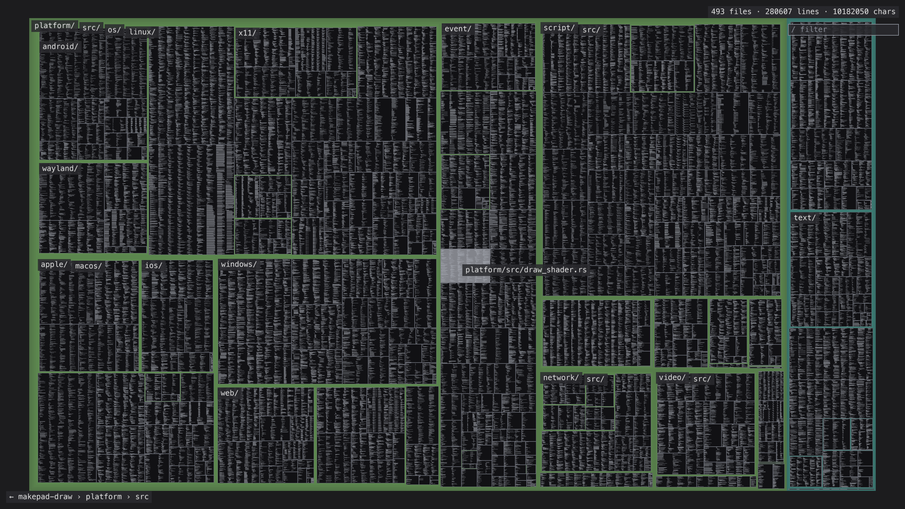

The same corpus with the filter `Window`: 31 files outlined in yellow at the overview, the rest dimmed, the panel populated.

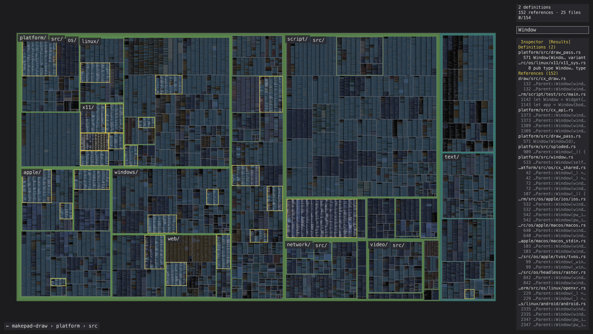

big-picture's own source at the four rungs, from the fitted map through 2, 4.5 and 16 device pixels per line: bars, token blocks with item outlines, then text.

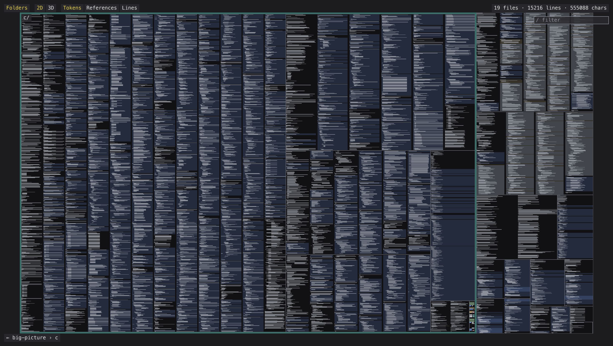
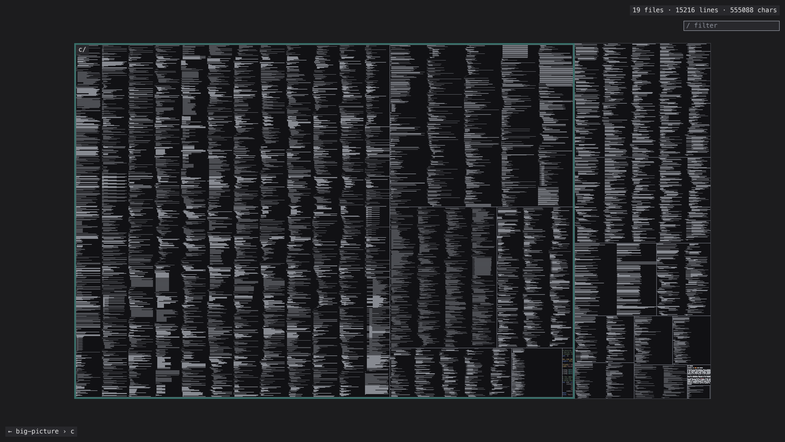
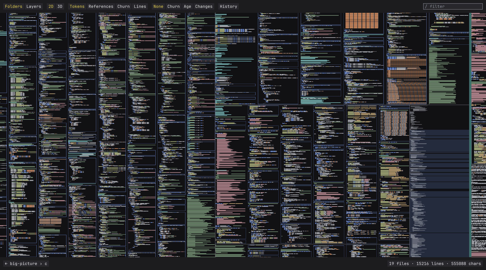
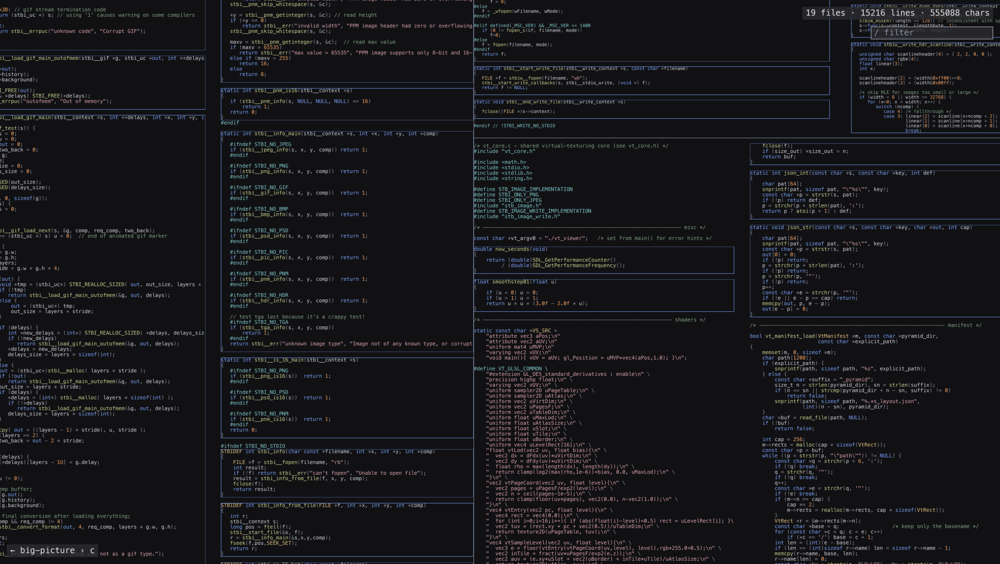

The resolver's view of makepad-draw: hovering `Window` in the x11 bindings, and the Inspector on the enum variant of the same name with its references grouped by file.

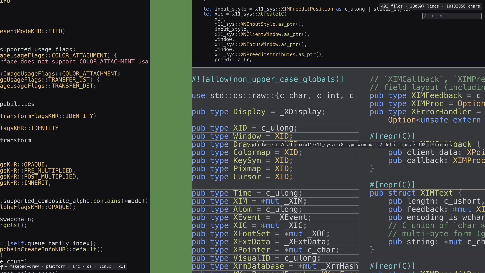
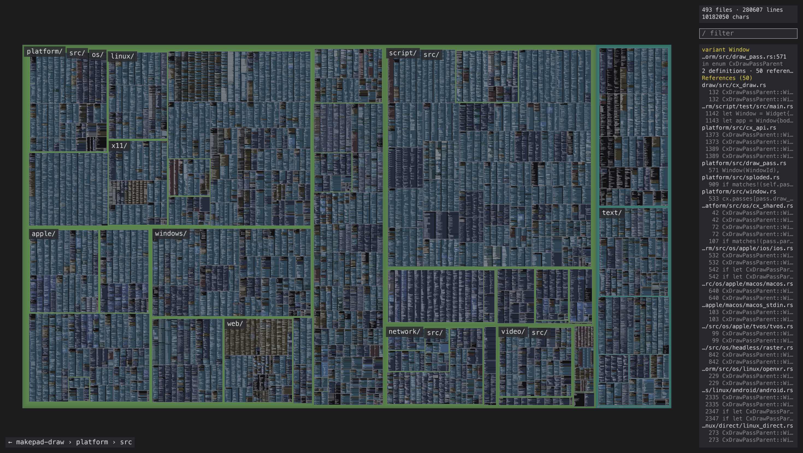

Filter and fly-to on big-picture: the hit file outlined and the panel listing the definition, then the view after stepping to the first result.

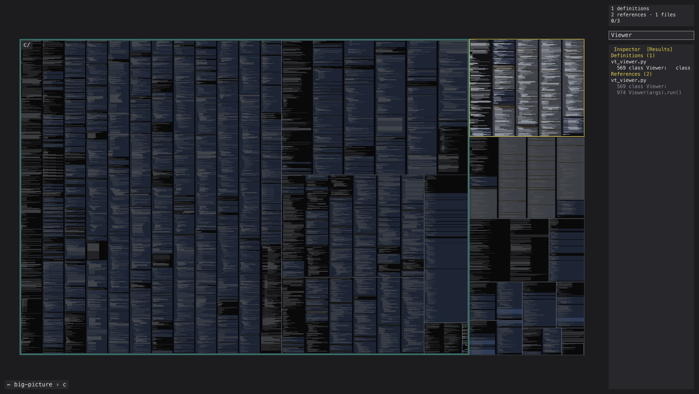
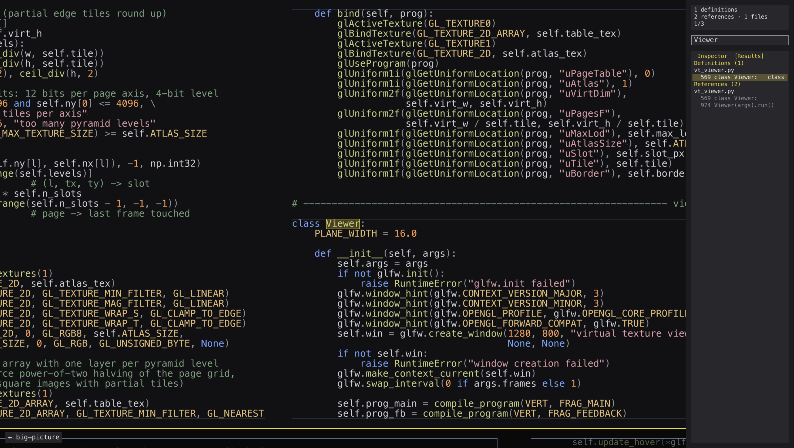

The two glyph tiers at 120 pixels per line: the 64 pixel raster atlas magnified (left) and the vector tier (right).

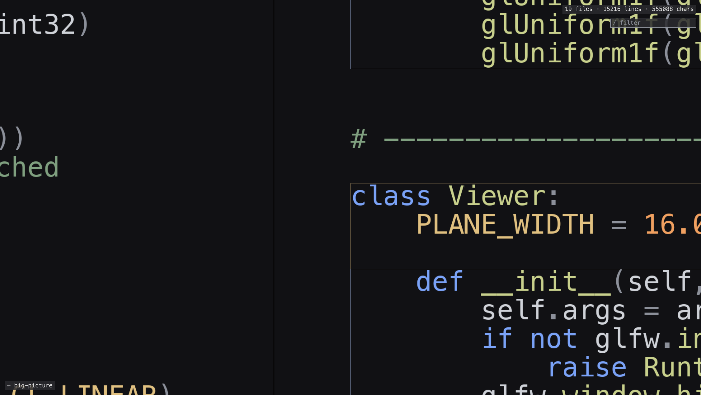
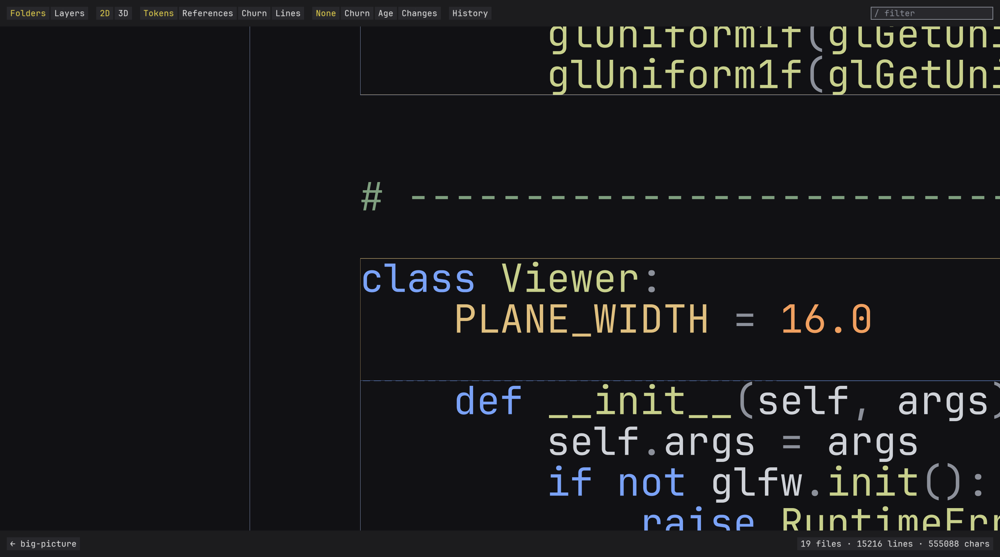

## Implementation

The contract that the code was built against is [docs/DESIGN.md](docs/DESIGN.md), including the deviations found while building. The short version:

- **Index.** `atlas_index.py` walks the tree (honouring `.gitignore`, skipping binaries), expands tabs, maps every character to one column, and runs a small regex tokenizer per language family (Rust, C-like, Python, shell, plain) that assigns one of ten kinds to every character. Items (functions, structs, enums, impls, modules) come from regexes with brace or indentation matching. Output is a handful of numpy arrays: the characters, their kinds, line offsets, file ranges, item ranges.
- **Layout.** `atlas_layout.py` is a squarified treemap over the directory tree with padding per level that the viewer draws as the directory band, so the bands widen as you zoom. Area is by tokens, as in the video's toolbar (characters, lines or bytes on request). Each file is wrapped into as many equal columns as keep about a 90th-percentile line width readable, at a pitch that fits its lines; lines longer than a column are clipped, not wrapped. A preview PNG and `tests/check_layout.py` check the invariants.
- **The ladder.** Per frame the viewer computes device pixels per line for every file and picks a rung: under 1, sampled one-pixel bars; 1 to 3, one grey bar per line from indent to length; 3 to 6, one block per character in its kind colour, plus item outlines; 6 and up, glyphs. Below 3 px the items are also drawn as filled bands in their kind colour under the bars, Rik's kind-bands representation, and from 3 px the outlines take over. The switches are hard cuts, as in the video. Everything is resident: characters and kinds as 8-bit textures, lines and files as float and integer textures, one instanced quad per line drawn per run of visible files, the border ring drawn again after the text.
- **Glyphs.** `atlas_font.py` rasterises the 95 printable ASCII glyphs of one monospace face into a mipmapped atlas that also draws the UI. `vt_glyphs.py` is the port of Dobbie's vector textures: quadratic outlines from fontTools, diced into a grid of curve lists, ray-cast per pixel in `shaders/vt_glyph.glsl`; its test measures a mean coverage error of 0.010 against Pillow at 96 pixels.
- **Resolver.** `atlas_resolve.py` parses every file with tree-sitter and collects entities (functions, methods, structs, fields, enums, variants, traits, type aliases, consts, statics, modules, macros, type parameters, parameters, locals) and every identifier use. Each use is resolved lexically, in order: the enclosing function's locals, the file, the file's `use` imports through the crate found by its Cargo.toml, a unique name in the crate, a unique name in the corpus, with type parameters, `Self`, enum paths and `Type::method` handled along the way; what is left is ambiguous, external (a crate not in the corpus), missing import, missing macro or not found, and the counts of each are the Inspector's coverage block. No type inference, so a method after a dot with several candidates is "method dispatch", the same category Rik's analyser reports. Rust is covered fully; Python and C get functions, types, parameters and locals. All of makepad resolves in 25 seconds on ten cores: 864k entities and 4.7 million references, 64 percent of them resolved, across 317 crates; Rik's Inspector reports 722k entities and 1.3 million edges for the same tree, so the scale matches even though the rules do not.
- **Filter.** A word that names an entity lists its definitions with their kinds and every reference with its status; any other word is a whole-word regex over the corpus in a thread, chunked so the frame loop keeps running, with mentions inside comments and strings excluded. `Window` in makepad-draw finds 2 definitions (the x11 type alias and an enum variant) and 152 references, 91 of them resolved to one or the other; Rik's analyser reports 119 and 1472 for all of makepad.
- **Fly-to** is van Wijk and Nuij's smooth zoom-and-pan, which zooms out and back in between distant places.

Measured on an M4 MacBook at a 2940 by 1658 framebuffer, `--frames 300 --stats` over the scripted zoom from fit to text: big-picture 1.2 ms mean and 3.4 ms 99th percentile; makepad-draw 1.6 and 4.4 ms; the full makepad tree 4.5 and 23.7 ms, the tail being the fitted view where all 3.67 million lines are visible, and 1.3 ms once zoomed to text.

Not built: the 3D projection and tilt, lenses other than Folders, history, and a streaming working set (the whole corpus is resident, which is fine to a few million lines).

## Decisions so far

The six questions below were settled on 2026-09-12 for the first build, and the answers with the module contracts are in [docs/DESIGN.md](docs/DESIGN.md): a source tree as the corpus; a raster glyph atlas as the text rung with a Dobbie-style vector tier as an optional module; our own atlas generators with Pillow and fontTools; Python with OpenGL 3.3, GLES-compatible shaders, big-picture's conventions; no pyramid, the ladder is drawn from instance data; everything resident on the GPU, streaming later. Not built yet: the resolver, 3D and tilt, lenses other than Folders, History. The questions stay here because the answers are provisional.

## Questions to settle first

1. Corpus and layout. Source trees, books, or whole filesystems? A source tree lays out like big-picture's photo mosaic: files are the pictures, directories the grouping, and a manifest gives hover and click. A book is 1273 pages in a grid. Both fit one layout stage if a "document" is just a rectangle with lines. A filesystem is the third shape: millions of nodes where most files have no text to show, so the ladder bottoms out at the treemap rung (makepad's mpfiles disk map does exactly this: pixel-bounded layout, siblings too small to see collapse into one block). dagcmp already scans and models such trees, and its compare statuses would colour a two-volume map the way token kinds colour code. Proposal: one layout stage where a document is a rectangle with lines, and a directory is a rectangle of documents; test with makepad's own repo (about 3 million lines), War and Peace, and a dagcmp scan of a full volume.
2. The glyph tier. Three candidates: Dobbie's curve ray-casting (exact, any magnification, heavy fragment shader), signed-distance atlases (cheap, soft corners when very large), or Lengyel's Slug as makepad uses (curves plus bands, the modern form of Dobbie's idea). Proposal: start with Dobbie's, because his shaders exist, run in WebGL 1, and his fallback to a mipmapped raster atlas is exactly the small-text tier we need anyway.
3. Atlas generation. Dobbie's preprocessor (a C++ program that reads a PDF and writes a vector atlas, a vertex buffer and a JSON file) was never published. We need our own: read a font with fontTools, convert outlines to quadratic beziers, dice each glyph into the grid cells his shader expects, and write the texture. This is the first real code in the repo and it decides whether the rest is possible.
4. Platform. big-picture is Python plus a C port; Dobbie is WebGL; makepad is Rust on Metal. Proposal: Python with OpenGL for the prototype, reusing big-picture's viewer skeleton, with every shader written to GLSL ES 1.0 so the same code runs in the C port and in a browser. The browser is where a code browser gets shared.
5. Do we keep a pyramid at all? For the two far rungs, yes, possibly: a tile pyramid whose coarse levels are generated from the source (bands, bars) rather than downsampled from the fine ones. That would let big-picture's viewer stream the ladder unchanged. Whether that beats drawing bars as instanced quads is an open question.
6. Budget and eviction. big-picture streams 256 by 256 pixel pages with an LRU. big-text streams per-file instance buffers whose size depends on the rung. makepad measures the machine at startup to size its upload budget. Which unit do we budget in: bytes uploaded per frame, glyphs resident, or both?

## Provenance and licences

- big-picture, dagcmp: MIT.
- makepad: MIT or Apache-2.0. Only the public repo is included, pinned at commit a2fdeb325 (dev, 2026-09-11).
- Dobbie's demos: no licence has been published, on the blog or with the files. The copies under `dobbie/` are here for study and as a reference implementation to test against. Until Will Dobbie says otherwise, this repo should stay private, or `dobbie/` should be excluded before it is published. Details, sources and checksums are in `dobbie/README.md`.

## Layout

```
big-text/
  README.md                    this file
  docs/DESIGN.md               the build contract and its deviations
  docs/shots/                  screenshots and the commands that made them
  notes/makepad-code-atlas.md  what the public makepad history and the video say about the code atlas
  atlas_index.py               source tree -> data/<name>_atlas/index.npz + index.json
  atlas_resolve.py             tree-sitter entities and lexically resolved references -> resolve.npz + resolve.json
  atlas_layout.py              index -> layout.npz + layout.json (+ --preview PNG)
  atlas_font.py                monospace font -> raster glyph atlas
  atlas_viewer.py              the viewer
  vt_glyphs.py                 the Dobbie vector-texture glyph tier
  shaders/                     GLSL 330, one file per program
  tests/                       layout invariants, viewer input, vector glyph accuracy, a synthetic atlas
  data/                        generated atlases and glyph caches (gitignored)
  dobbie/                      the two live demos, verified against wdobbie.com
  big-picture/                 submodule, pinned
  dagcmp/                      submodule, pinned
  makepad/                     submodule, pinned
```

Two large binaries (the War and Peace glyph buffer, 53 MB, and the PDF demo's vertex buffer, 18 MB) are ignored by git. `dobbie/fetch.sh` downloads them from wdobbie.com and checks their checksums.
